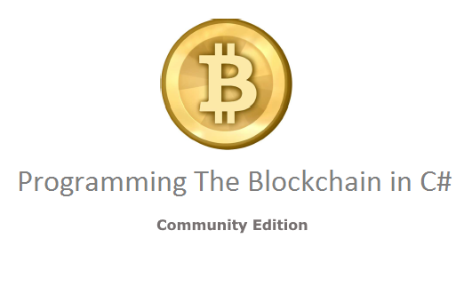

  

[Click here for code examples](https://github.com/ProgrammingBlockchain/ProgrammingBlockchainCodeExamples/)
## [Click here to read the book](https://programmingblockchain.gitbooks.io/programmingblockchain/content/)

## Community

## Other languages
- Indonesian: [Read](https://programmingblockchain.gitbooks.io/programmingblockchainindonesian/content/) - [GitHub](https://github.com/ProgrammingBlockchain/ProgrammingBlockchain-Indonesian) - [GitBook](https://programmingblockchain.gitbook.io/programmingblockchainindonesian/)  
- Japanese: [Read](https://programmingblockchain.gitbooks.io/programmingblockchain-japanese/content/) - [GitHub](https://github.com/ProgrammingBlockchain/ProgrammingBlockchain-Japanese) - [GitBook](https://www.gitbook.com/book/programmingblockchain/programmingblockchain-japanese)
- Korean: [GitHub](https://github.com/ProgrammingBlockchain/ProgrammingBlockchain-Korean) 

## Quick feedback
If you notice any mistakes and don't want to fix them yourself, open an issue [on the GitHub page of the book.](https://github.com/ProgrammingBlockchain/ProgrammingBlockchain)  
If you are reading this book with GitBook, you can also create a quick inline comment by clicking the "+" button for the paragraph.

## How can I fix a typo? aka quick contribution
1. Find [the book on GitHub](https://github.com/ProgrammingBlockchain/ProgrammingBlockchain)
2. Fork
3. Edit file
4. Make a pull request

## How can I write a new chapter? aka extensive contribution
1. Find [the book on GitHub](https://github.com/ProgrammingBlockchain/ProgrammingBlockchain)
2. Fork
3. Clone your fork
4. Download and install [GitBook Editor](https://legacy.gitbook.com/editor)
5. Open GitBook Editor
6. Select "Import" and select the folder where you cloned your fork
7. Edit book
8. Save files and Sync
9. Make a pull request

## How can I write a new chapter? aka extensive contribution (for those literate in git and markdown)
1. Find [the book on GitHub](https://github.com/ProgrammingBlockchain/ProgrammingBlockchain)
2. Fork
3. Clone your fork to your computer
4. Download and install the [Atom editor](https://atom.io/) (or your favorite editors: notepad++, vim, etc.)
5. Open Atom
6. Select "Open Folder" and select the folder where you cloned your fork
7. Edit the book with the help of the Markdown Preview package (Cmd/Ctrl-Shift-M)
8. Save files
9. Commit and push to your remote repo with your favorite git client (GitHub Desktop, Git BASH, SourceTree, etc.)
10. Make a pull request

## Enhancing your learning process  
Making contributions while you are reading is a good way to learn faster. If you have a hard time understanding something, try to reword it and make a pull request for other readers.

You can also help [fixing issues](https://github.com/ProgrammingBlockchain/ProgrammingBlockchain/issues). (Protip for university students: a good GitHub profile is more valuable than a diploma in the job market.)

## How to feed us
For every donation on this address, you will appear on [http://n.bitcoin.ninja/](http://n.bitcoin.ninja/).  

  

[1KF8kUVHK42XzgcmJF4Lxz4wcL5WDL97PB](https://www.smartbit.com.au/address/1KF8kUVHK42XzgcmJF4Lxz4wcL5WDL97PB)

## Links

[The book on GitHub](https://github.com/ProgrammingBlockchain/ProgrammingBlockchain)  
[The book on GitBook](https://www.gitbook.com/book/programmingblockchain/programmingblockchain)
[Code examples on GitHub](https://github.com/ProgrammingBlockchain/ProgrammingBlockchainCodeExamples/)  
[Hall of the Makers](http://n.bitcoin.ninja/) (here are the true makers: those that succeeded in completing the challenges of this book.)
