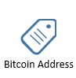
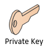
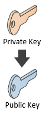
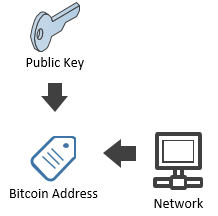
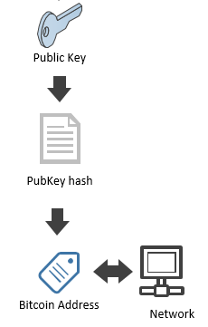

## Bitcoin address {#bitcoin-address}

You know that your **Bitcoin Address** is what you share to the world to get paid.  
  
You probably know that your wallet software uses a **private key** to spend the money you received on this address.  
  

The keys are not stored on the network and they can be generated without access to the Internet.  

This is how you generate a private key with NBitcoin:  
```cs  
Key privateKey = new Key(); // generate a random private key
```  
From the private key, we use a one-way cryptographic function, to generate a **public key**.  

  
```cs 
PubKey publicKey = privateKey.PubKey;
Console.WriteLine(publicKey); // 0251036303164f6c458e9f7abecb4e55e5ce9ec2b2f1d06d633c9653a07976560c
```  

There are two Bitcoin **networks**: 
* **TestNet** is a Bitcoin network for development purposes. Bitcoins on this network worth nothing.  
* **MainNet** is the Bitcoin network everybody uses.  

> **Note:** You can acquire testnet coins quickly by using **faucets**, just google "get testnet bitcoins".  

You can easily get your **bitcoin address** from your public key and the **network** on which this address should be used. 

  

```cs 
Console.WriteLine(publicKey.GetAddress(ScriptPubKeyType.Legacy, Network.Main)); // 1PUYsjwfNmX64wS368ZR5FMouTtUmvtmTY
Console.WriteLine(publicKey.GetAddress(ScriptPubKeyType.Legacy, Network.TestNet)); // n3zWAo2eBnxLr3ueohXnuAa8mTVBhxmPhq
```  

**To be precise, a bitcoin address is made up of a version byte (which is different on both networks) and your public key’s hash bytes. Both of these bytes are concatenated and then encoded into a Base58Check:**  

  

```cs 
var publicKeyHash = publicKey.Hash;
Console.WriteLine(publicKeyHash); // f6889b21b5540353a29ed18c45ea0031280c42cf
var mainNetAddress = publicKeyHash.GetAddress(Network.Main);
var testNetAddress = publicKeyHash.GetAddress(Network.TestNet);
```  

> **Fact:** A public key hash is generated by using a SHA256 hash on the public key, then a RIPEMD160 hash on the result, using Big Endian notation. The function could look like this: RIPEMD160(SHA256(pubkey))  

The Base58Check encoding has some neat features, such as checksums to prevent typos and a lack of ambiguous characters such as '0' and 'O'.  
The Base58Check encoding also provides a consistent way to determine the network of a given address; preventing a wallet from sending MainNet coins to a TestNet address.

```cs 
Console.WriteLine(mainNetAddress); // 1PUYsjwfNmX64wS368ZR5FMouTtUmvtmTY
Console.WriteLine(testNetAddress); // n3zWAo2eBnxLr3ueohXnuAa8mTVBhxmPhq
```  

> **Tip:** Practicing Bitcoin Programming on MainNet makes mistakes more memorable.  
