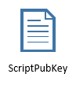
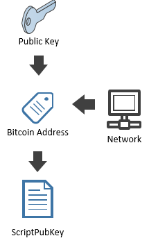

## ScriptPubKey {#payment-script}
You might not know that as far as the Blockchain is concerned, there is no such thing as a Bitcoin Address. Internally, the Bitcoin protocol identifies the recipient of Bitcoin by a **ScriptPubKey**.  

  
A **ScriptPubKey** may looks like this:  
```OP_HASH160 14836dbe7f38c5ac3d49e8d790af808a4ee9edcf OP_EQUALVERIFY OP_CHECKSIG```  

It is a short script that explains what conditions must be met to claim ownership of bitcoins. We will go into the types of operations in a **ScriptPubKey** as we move through the lessons of this book.  

We are able to generate the ScriptPubKey from the Bitcoin Address. This is a step that all bitcoin clients do to translate the “human friendly” Bitcoin Address to the Blockchain readable address.

  

```cs 
var publicKeyHash = new KeyId("14836dbe7f38c5ac3d49e8d790af808a4ee9edcf");

var testNetAddress = publicKeyHash.GetAddress(Network.TestNet);
var mainNetAddress = publicKeyHash.GetAddress(Network.Main);

Console.WriteLine(mainNetAddress.ScriptPubKey); // OP_DUP OP_HASH160 14836dbe7f38c5ac3d49e8d790af808a4ee9edcf OP_EQUALVERIFY OP_CHECKSIG
Console.WriteLine(testNetAddress.ScriptPubKey); // OP_DUP OP_HASH160 14836dbe7f38c5ac3d49e8d790af808a4ee9edcf OP_EQUALVERIFY OP_CHECKSIG
```  

Notice the **ScriptPubKey** for testnet and mainnet address is the same?  
Notice the **ScriptPubKey** contains the hash of the public key?  
We will not go into the details yet, but note that the **ScriptPubKey** appears to have nothing to do with the Bitcoin Address, but it does show the hash of the public key.  

Bitcoin Addresses are composed of a version byte which identify the network where to use the address and the hash of a public key. So we can go backward and generate a bitcoin address from the **ScriptPubKey** and the network identifier.

```cs
var paymentScript = publicKeyHash.ScriptPubKey;
var sameMainNetAddress = paymentScript.GetDestinationAddress(Network.Main);
Console.WriteLine(mainNetAddress == sameMainNetAddress); // True
```   

It is also possible to retrieve the hash from the **ScriptPubKey** and generate a Bitcoin Address from it:  

```cs
var samePublicKeyHash = (KeyId) paymentScript.GetDestination();
Console.WriteLine(publicKeyHash == samePublicKeyHash); // True
var sameMainNetAddress2 = new BitcoinPubKeyAddress(samePublicKeyHash, Network.Main);
Console.WriteLine(mainNetAddress == sameMainNetAddress2); // True
```   

> **Note:** A ScriptPubKey does not necessarily contains the hashed public key(s) permitted to spend the bitcoin.  

So now you understand the relationship between a Private Key, a Public Key, a Public Key Hash, a Bitcoin Address and a ScriptPubKey.

In the reminder of this book, we will exclusively use **ScriptPubKey**. A Bitcoin Address is only a user interface concept.