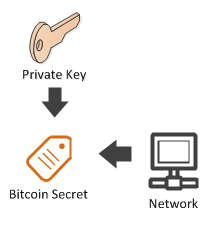

## 개인 키 {#private-key}

개인 키는 때때로 비트코인 주소와 같이 **Bitcoin Secret** (**Wallet Import Format** 또는 간단히 **WIF** 라고도 함) 으로 불리어지는 Base58Check로 표시됩니다 .

  

```cs  
Key privateKey = new Key(); // generate a random private key
BitcoinSecret mainNetPrivateKey = privateKey.GetBitcoinSecret(Network.Main);  // generate our Bitcoin secret(also known as Wallet Import Format or simply WIF) from our private key for the mainnet
BitcoinSecret testNetPrivateKey = privateKey.GetBitcoinSecret(Network.TestNet);  // generate our Bitcoin secret(also known as Wallet Import Format or simply WIF) from our private key for the testnet
Console.WriteLine(mainNetPrivateKey); // L5B67zvrndS5c71EjkrTJZ99UaoVbMUAK58GKdQUfYCpAa6jypvn
Console.WriteLine(testNetPrivateKey); // cVY5auviDh8LmYUW8AfafseD6p6uFoZrP7GjS3rzAerpRKE9Wmuz

bool WifIsBitcoinSecret = mainNetPrivateKey == privateKey.GetWif(Network.Main);
Console.WriteLine(WifIsBitcoinSecret); // True
```  

**BitcoinSecret**를 사용하면 개인 **Key**를 쉽게 생성 할 수 있습니다. 반면에, 비트코인 주소에는 공개 키 값이 아닌 공개 키의 해시 값을 가지고 있기 때문에 비트코인 주소로 공개 키 값을 생성 할 수 없습니다.
다음 두 코드 블록 간의 유사성을 비교하면 위의 차이를 이해 할 수 있습니다:

```cs
Key privateKey = new Key(); // generate a random private key
BitcoinSecret bitcoinSecret = privateKey.GetWif(Network.Main); // L5B67zvrndS5c71EjkrTJZ99UaoVbMUAK58GKdQUfYCpAa6jypvn
Key samePrivateKey = bitcoinSecret.PrivateKey;
Console.WriteLine(samePrivateKey == privateKey); // True
```  

```cs
PubKey publicKey = privateKey.PubKey;
BitcoinAddress bitcoinAddress = publicKey.GetAddress(ScriptPubKeyType.Legacy, Network.Main); // 1PUYsjwfNmX64wS368ZR5FMouTtUmvtmTY
//PubKey samePublicKey = bitcoinAddress.ItIsNotPossible;
```  

### 연습:
1. 메인 넷에서 개인 키를 생성하고 기록해 둡니다.
2. 해당 주소를 가져옵니다.
3. 그것에 비트코인을 보냅니다. 잃어 버려도 될 만큼만 보내세요, 차후 수업에서 다시 찾을 수 있도록 집중력과 동기가 부여 될 것입니다.