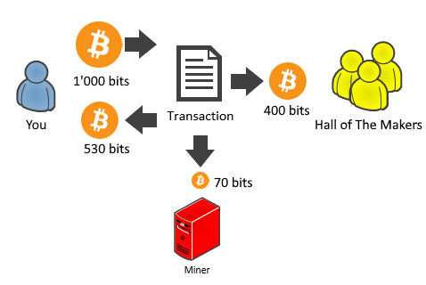

## Spend your coin {#spend-your-coin}

So now that you know what a **bitcoin address**, a **ScriptPubKey**, a **private key** and a **miner** are, you will make your first **transaction** by hand.

As you proceed through this lesson you will add code line by line as it is presented to build a method that will leave feedback for the book in a Twitter style message. I _highly recommend_ you to follow the instructions first on the TestNet and after do them again on the Main Bitcoin network.

Let’s start by looking at the **transaction** that contains the **TxOut** that you want to spend as we did previously:

Create a new **Console Project** \(&gt;.net45\) and install **QBitNinja.Client** NuGet.

Have you already generated and noted down a private key yourself? Did you already get the corresponding bitcoin address and sent some funds there? If not, don't worry, I quickly reiterate how you can do it:

```cs
// Replace this with Network.Main to do this on Bitcoin MainNet
var network = Network.TestNet;

var privateKey = new Key();
var bitcoinPrivateKey = privateKey.GetWif(network);
var address = bitcoinPrivateKey.GetAddress();

Console.WriteLine(bitcoinPrivateKey);
Console.WriteLine(address);
```

Note that we use the TestNet first, but you will probably do this on the MainNet as well, so you are going to spend real money! In any case, write down the **bitcoinPrivateKey** and the address! Send a few dollars of coins there and save the transaction ID \(you can find it in your wallet software or with a blockexplorer, like SmartBit for [MainNet](http://smartbit.com.au/) and [TestNet](https://testnet.smartbit.com.au/)).

Import your private key (replace the "cN5Y...K2RS" string with yours):

```cs
var bitcoinPrivateKey = new BitcoinSecret("cN5YQMWV8y19ntovbsZSaeBxXaVPaK4n7vapp4V56CKx5LhrK2RS", Network.Testnet);
var network = bitcoinPrivateKey.Network;
var address = bitcoinPrivateKey.GetAddress();

Console.WriteLine(bitcoinPrivateKey); // cN5YQMWV8y19ntovbsZSaeBxXaVPaK4n7vapp4V56CKx5LhrK2RS
Console.WriteLine(address); // mkZzCmjAarnB31n5Ke6EZPbH64Cxexp3Jp
```

And finally get the transaction info (replace the "0acb...b78a" with the one you got from your wallet software or blockchain explorer after you sent the coins):

```cs
var client = new QBitNinjaClient(network);
var transactionId = uint256.Parse("0acb6e97b228b838049ffbd528571c5e3edd003f0ca8ef61940166dc3081b78a");
var transactionResponse = client.GetTransaction(transactionId).Result;

Console.WriteLine(transactionResponse.TransactionId); // 0acb6e97b228b838049ffbd528571c5e3edd003f0ca8ef61940166dc3081b78a
Console.WriteLine(transactionResponse.Block.Confirmations); // 91
```

Now we have every bit of information we need to create our transactions. The main questions are: **from where, to where and how much?**

### From where?

In our case, we want to spend the second outpoint. Here's how we have figured this out:

```cs
var receivedCoins = transactionResponse.ReceivedCoins;
OutPoint outPointToSpend = null;
foreach (var coin in receivedCoins)
{
    if (coin.TxOut.ScriptPubKey == bitcoinPrivateKey.GetAddress(ScriptPubKeyType.Legacy).ScriptPubKey)
    {
        outPointToSpend = coin.Outpoint;
    }
}
if(outPointToSpend == null)
    throw new Exception("TxOut doesn't contain our ScriptPubKey");
Console.WriteLine("We want to spend {0}. outpoint:", outPointToSpend.N + 1);
```

For the payment you will need to reference this outpoint in the transaction. You create a transaction as follows:

```cs
var transaction = Transaction.Create(network);
transaction.Inputs.Add(new TxIn()
{
    PrevOut = outPointToSpend
});
```

### To where?

Do you remember the main questions? **From where, to where and how much?**  
Constructing the **TxIn** and adding it to the transaction is the answer to the "from where" question.  
Constructing the **TxOut** and adding it to the transaction is the answer to the remaining ones.

> The donation address of this book is: [1KF8kUVHK42XzgcmJF4Lxz4wcL5WDL97PB](https://www.smartbit.com.au/address/1KF8kUVHK42XzgcmJF4Lxz4wcL5WDL97PB)  
This money goes into Nicolas' "Coffee and Sushi Wallet" that will keep him fed and compliant while writing the rest of the book.  
If you succeed in completing this challenge on the MainNet you will be able to find your contribution among the **Hall of the Makers** on [http://n.bitcoin.ninja/](http://n.bitcoin.ninja/) \(ordered by generosity\).

To get our MainNet address:
```cs
var hallOfTheMakersAddress = new BitcoinPubKeyAddress("1KF8kUVHK42XzgcmJF4Lxz4wcL5WDL97PB", Network.Main);
```

Or if you are working on TestNet, send the TestNet coins to any address. I used [mzp4No5cmCXjZUpf112B1XWsvWBfws5bbB](https://testnet.smartbit.com.au/address/mzp4No5cmCXjZUpf112B1XWsvWBfws5bbB).

```cs
var hallOfTheMakersAddress = BitcoinAddress.Create("mzp4No5cmCXjZUpf112B1XWsvWBfws5bbB", Network.TestNet);
```

### How much?

Bitcoin has [several units to use](https://en.bitcoin.it/wiki/Units), but there are three you should know about: bitcoins, bits and satoshis. 1 bitcoin (BTC) is 1,000,000 bits and 100 satoshis are 1 bit. 1 satoshi (sat) is the smallest unit on the Bitcoin network.  

If you want to send **0.0004 BTC** (a few dollars) from an **unspent output**, which holds **0.001 BTC**, you actually have to spend it all!  
As the diagram shows below, your **transaction output** specifies  **0.0004 BTC** to [Hall of The Makers](http://n.bitcoin.ninja/) and **0.00053 BTC** back to you.  
What happens to the remaining **0.00007 BTC**? This is the _miner fee_.  
The miner fee incentivizes the miners to add this transaction into their next block. The higher the miner fee the more motivated the miner is to include your transaction in the next block, meaning that your transaction will be confirmed faster. If you set the miner fee to zero, your transaction might never be confirmed.



```cs
transaction.Outputs.Add(Money.Coins(0.0004m), hallOfTheMakersAddress.ScriptPubKey);
// Send the change back
transaction.Outputs.Add(new Money(0.00053m, MoneyUnit.BTC), bitcoinPrivateKey.ScriptPubKey);
```

We can do some fine tuning here, let's calculate the change based on the miner fee.  

```cs
// How much you want to spend
var hallOfTheMakersAmount = new Money(0.0004m, MoneyUnit.BTC);

// How much miner fee you want to pay
/* Depending on the market price and
 * the currently advised mining fee,
 * you may consider to increase or decrease it.
 */
var minerFee = new Money(0.00007m, MoneyUnit.BTC);

// How much you want to get back as change
var txInAmount = (Money)receivedCoins[(int) outPointToSpend.N].Amount;
var changeAmount = txInAmount - hallOfTheMakersAmount - minerFee;
```

Let's use our calculated values for our TxOuts instead:

```cs
transaction.Outputs.Add(hallOfTheMakersAmount, hallOfTheMakersAddress.ScriptPubKey);
// Send the change back
transaction.Outputs.Add(changeAmount, bitcoinPrivateKey.ScriptPubKey);
```

### Message on The Blockchain

Now add your personal feedback! This must be less than or equal to 80 bytes or your transaction will get rejected.  
This message along with your transaction will appear \(after your transaction is confirmed\) in the [Hall of The Makers](http://n.bitcoin.ninja/)! :)

```cs
var message = "Long live NBitcoin and its makers!";
var bytes = Encoding.UTF8.GetBytes(message);
transaction.Outputs.Add(Money.Zero, TxNullDataTemplate.Instance.GenerateScriptPubKey(bytes));
```

### Summary
To sum up, let's take a look at the whole transaction before we sign it:  
We have 3 **TxOut**, 2 with **value**, 1 without **value** \(which contains the message\). You can notice the differences between the **scriptPubKey**s of the "normal" **TxOut**s and the **scriptPubKey** of the **TxOut** within the message:

```json
{
  "hash": "eeffd48b317e7afa626145dffc5a6e851f320aa8bb090b5cd78a9d2440245067",
  "ver": 1,
  "vin_sz": 1,
  "vout_sz": 3,
  "lock_time": 0,
  "size": 164,
  "in": [
    {
      "prev_out": {
        "hash": "0acb6e97b228b838049ffbd528571c5e3edd003f0ca8ef61940166dc3081b78a",
        "n": 0
      },
      "scriptSig": ""
    }
  ],
  "out": [
    {
      "value": "0.00040000",
      "scriptPubKey": "OP_DUP OP_HASH160 d3a689bc36464b9d74e1721fd321d4686eae594e OP_EQUALVERIFY OP_CHECKSIG"
    },
    {
      "value": "0.00053000",
      "scriptPubKey": "OP_DUP OP_HASH160 376b786582a3423bcdda4517ea87f0a7e862f27b OP_EQUALVERIFY OP_CHECKSIG"
    },
    {
      "value": "0.00000000",
      "scriptPubKey": "OP_RETURN 4c6f6e67206c697665204e426974636f696e20616e6420697473206d616b65727321"
    }
  ]
}
```

Take a closer look at **TxIn**. We have **prev\_out** and **scriptSig** there.  
**Exercise:** try to figure out what **scriptSig** will be and how to get it in our code before you read further!

Let's check out the **hash** of **prev\_out** in a TestNet blockexplorer: [prev\_out tx details](https://testnet.smartbit.com.au/tx/0acb6e97b228b838049ffbd528571c5e3edd003f0ca8ef61940166dc3081b78a).  You can see that 0.001 BTC was transferred to our address.

In **prev\_out** **n** is 0. Since we are indexing from 0, this means that we want to spend the first output of the transaction (the second one is the 1.0989548 BTC change from the transaction).  

### Sign your transaction

Now that we have created the transaction, we must sign it. In other words, you will have to prove that you own the TxOut that you referenced in the input.

Signing can be [complicated](https://en.bitcoin.it/w/images/en/7/70/Bitcoin_OpCheckSig_InDetail.png), but we’ll make it simple.

First let's revisit the **scriptSig** of **in** and how we can get it from code. We have two options to fill the ScriptSig with the ScriptPubKey of our address:

```cs
// Get it from the public address
var address = BitcoinAddress.Create("mkZzCmjAarnB31n5Ke6EZPbH64Cxexp3Jp", Network.TestNet);
transaction.Inputs[0].ScriptSig = address.ScriptPubKey;

// OR we can also use the private key 
var bitcoinPrivateKey = new BitcoinSecret("cN5YQMWV8y19ntovbsZSaeBxXaVPaK4n7vapp4V56CKx5LhrK2RS", Network.TestNet);
transaction.Inputs[0].ScriptSig =  bitcoinPrivateKey.ScriptPubKey;
```

Then you need to provide your private key in order to sign the transaction:

```cs
transaction.Sign(bitcoinPrivateKey, receivedCoins.ToArray());
```
After this command the ScriptSig property of the input will be replaced by the signature, making the transaction signed.  

You can check out our TestNet transaction on the blockchain explorer [here](https://testnet.smartbit.com.au/tx/eeffd48b317e7afa626145dffc5a6e851f320aa8bb090b5cd78a9d2440245067).

### Propagate your transactions

Congratulations, you have signed your first transaction! Your transaction is ready to roll! All that is left is to propagate it to the network so the miners can see it.

#### With QBitNinja:

```cs
BroadcastResponse broadcastResponse = client.Broadcast(transaction).Result;

if (!broadcastResponse.Success)
{
    Console.Error.WriteLine("ErrorCode: " + broadcastResponse.Error.ErrorCode);
    Console.Error.WriteLine("Error message: " + broadcastResponse.Error.Reason);
}
else
{
    Console.WriteLine("Success! You can check out the hash of the transaciton in any block explorer:");
    Console.WriteLine(transaction.GetHash());
}
```

#### With your own Bitcoin Core:

```cs
using (var node = Node.ConnectToLocal(network)) //Connect to the node
{
    node.VersionHandshake(); //Say hello
                             //Advertize your transaction (send just the hash)
    node.SendMessage(new InvPayload(InventoryType.MSG_TX, transaction.GetHash()));
    //Send it
    node.SendMessage(new TxPayload(transaction));
    Thread.Sleep(500); //Wait a bit
}
```

The **using** code block will take care of closing the connection to the node. That's it!

You can also connect directly to the Bitcoin network, however I advise you to connect to your own trusted node as it is faster and easier.

## Need more practice?

YouTube: [How to make your first transaction with NBitcoin](https://www.youtube.com/watch?v=X4ZwRWIF49w)  
CodeProject: [Create a Bitcoin transaction by hand.](http://www.codeproject.com/Articles/1151054/Create-a-Bitcoin-transaction-by-hand)  
CodeProject: [Build your own Bitcoin wallet](https://www.codeproject.com/Articles/1115639/Build-your-own-Bitcoin-wallet)

