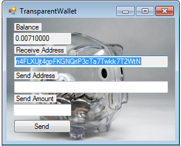
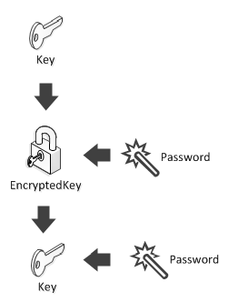

# HiddenBitcoin: Managing keys (HD wallet) {#hiddenbitcoin-keystorage}  

([nopara73](https://github.com/nopara73)) I am developing a privacy oriented Bitcoin wallet, called [HiddenWallet](https://github.com/nopara73/HiddenWallet). The [HiddenBitcoin](https://github.com/nopara73/HiddenBitcoin) library is the introduction of an other abstraction layer between NBitcoin and the user interface.  

A Bitcoin wallet have three key functions and this case study will be structured around them:  

1. Securely stores keys and manages the access to them.  
2. Monitors these keys, and other keys on The Blockchain.  
3. Builds transactions and submits them.  

In this lesson I am going to tackle the key storage function.  
If you want to examine the code more extensively you can find the solution on [GitHub](https://github.com/nopara73/HiddenBitcoin).  
If you just want to know how to quickly set it up and use it you can find my high level tutorial on [CodeProject](http://www.codeproject.com/Articles/1096320/HiddenBitcoin-High-level-Csharp-Bitcoin-wallet-lib).  

**How high level is it?** In my opinion a GUI developer, designer should not be able to make too much mistakes. They should not know about inputs and outputs and scriptpubkeys. They should stick at the addresses, privatekeys and wallets level. Also NBitcoin should be fully abstracted away.  

## Key storage design decisions  

Now it is a great time to give you a template on what decisions have to be make for storing the keys and what to keep in mind while making them.  

### Using only one key  

This is a shortcut. There are not too many situations I can come up with where going down this road can be justified. Yet it is not impossible it will be the most suitable for your needs.  
As a bad example here is an illustration for a Bitcoin wallet I have built, what only uses one key. I leave it to you to think of the consequences.  

  

### JBOK wallets  

It stands for **J**ust a **B**unch **O**f **K**eys. At the time of writing the reference client uses this method to store keys.  
The problem with this the user has to periodically backup his wallet. Yet if you want to be able importing or dropping keys, changing password you need to use this or some kind of hybrid combination of this and a deterministic wallet. I decided not to use this since my HiddenWallet is trying to innovate towards privacy and I can have a more sound wallet structure without it.  

### BIP38 (Part 2) - Untrusted third party key generator  
Just to reiterate: the idea is to generate a PassphraseCode to the key generator. With this PassphraseCode, he will be able to generate encrypted keys on your behalf, without knowing your password, nor any private key.  
HiddenWallet is a desktop wallet (and probably it is not going to change for a while). Thus I do not need to use an untrusted third party for key generation and key storage purposes. I decided not to implement it just yet.  

### SHD wallet  

This is the wallet structure I have implemented. Ok, you got me, I just came up with this word. It does not exist and nobody uses it. But in my mind it stands for **S**tealth and **H**ierarchical **D**eterministic wallet. It is the best way to describe what I built.  
Before I get into the code I would like to note I have only implemented the Stealth part of it, becuase it was a low hanging fruit. I am not sure stealth addresses will have any use in the future of Bitcoin.  

A stealth address looks like this: ```waPXAvDCDGv8sXYRY6XDEymDGscYeepXBV5tgSDF1JHn61rzNk4EXTuBfx22J2W9rPAszXFmPXwD2m52psYhXQe5Yu1cG26A7hkPxs```  

## Black box  
I implemented a class, called it **Safe**. Using this class, as a black box is intuitive.  

```cs
var network = Network.MainNet;
```  

The **Network** is not **NBitcoin.Network**, since the GUI developer should not know it is using NBitcoin. Also you have more network options to choose from in NBitcoin, but HiddenBitcoin is cannot handle all of them. At the moment it supports ```MainNet``` and ```TestNet```.  
The Network is an enum, it can be found under **HiddenBitcoin.DataClasses** namespace.  

```cs
string mnemonic;
Safe safe = Safe.Create(out mnemonic, "password", walletFilePath: @"Wallets\hiddenWallet.hid", network);
Console.WriteLine(mnemonic);
```  

You can also load or recover the safe:  

```cs
Safe loadedSafe = Safe.Load("password", walletFilePath: @"Wallets\hiddenWallet.hid");
if (network != loadedSafe.Network)
    throw new Exception("WrongNetwork");

Safe recoveredSafe = Safe.Recover(mnemonic, "password", walletFilePath: @"Wallets\sameHiddenWallet.hid", network);
```  

You can also get some keys out of the safe as strings:  

```cs
Console.WriteLine("Seed private key: " + safe.Seed);
Console.WriteLine("Seed public key: " + safe.SeedPublicKey);
Console.WriteLine("Third child address: " + safe.GetAddress(2));
Console.WriteLine("First child private key: " + safe.GetPrivateKey(0));
Console.WriteLine("Second child private key and the corresponding address: ");
Console.WriteLine(safe.GetPrivateKeyAddressPair(1).PrivateKey);
Console.WriteLine(safe.GetPrivateKeyAddressPair(1).Address);
Console.WriteLine("The stealth address: " + safe.StealthAddress);
Console.WriteLine("Scan and spend private keys for stealth payments:");
Console.WriteLine(loadedSafe.ScanPrivateKey);
Console.WriteLine(loadedSafe.SpendPrivateKey);
```  

```
Seed private key: xprv9s21ZrQH143K4RBm26TMm3qwTtR3Eyh22xDEN3TBebgfAvHPPSjxxFnFGDtnNHvqZ7pihGmAc8o9y1UvfEzcxSzyXAnmvTBowCNi69nXsqJ
Seed public key: xpub661MyMwAqRbcGuGE87zN8Bng1vFXeSQsQB8qARroCwDe3icXvz4DW46j7U6fX8NsKhqcxR7K1mDX4gTbtvCGdeJz5M7py3yEqMsjUH2DYhb
Third child address: 17pGpPX1A2sCdqJXsC5BiwdFphFVgJR9nk
First child private key: xprv9ubnoo3dgCYfrWbYBEM71WoBvzwTtQemEdjW836CeWJYunYBskQhq3nrJMvNBCCFpnU5GbgbL1b2QbPHA4rRPESEhqfKzae5oWe7SAMuxAV
Second child private key and the corresponding address:
xprv9ubnoo3dgCYfuE1hVB3F3Sh5YFJUNUjyZ68PDzPNhpmtqWDtD45zucZYMUAjY22HNxaY6tsvGAdJdcyALCMm2mTAvA4pEp1m7y3BSccKY4r
19FHdsj2YT79TuxbWcDMz9opTU28L1memr
The stealth address: vJmuFuLggpgzivm3UUjQguLhMA6C1SnYFJu5N6QkmXYRCU3nG1Ww36VcXy6zXpJvGeVTidxcsu7U19sfB1rxHhzvSNV5eGGLk6G1Cb
Scan and spend private keys for stealth payments:
L5CTS4U27umRfSBu2ztxsyUeMEYzJJk3HvCp3deSQBJWmRSUqCLg
KyXveppF4Xm3KwJgG7EBSi6SxfMTkaDXYYmv7c7xWRcF7yUNpswp
```  

**Note:** Ideally the seed keys are never used. It is a better practice if you start iterating through the keys with the getters of the safe.   

## White box  

### Safe.Create  

```cs
// Creates a mnemonic, a seed, encrypts it and stores in the specified path.
public static Safe Create(out string mnemonic, string password, string walletFilePath, Network network)
{
    var safe = new Safe(password, walletFilePath, network);
    mnemonic = safe.SetSeed(password).ToString();
    safe.Save(password, walletFilePath, network);

    return safe;
}
```  

```safe.SetSeed``` creates a mnemonic and set the ```_seedPrivateKey```. Finally it returns the mnemonic, so we can give it back to the user of the class.  

  

```cs
private ExtKey _seedPrivateKey;
private Mnemonic SetSeed(string password)
{
    var mnemonic = new Mnemonic(Wordlist.English, WordCount.Twelve);

    _seedPrivateKey = mnemonic.DeriveExtKey(password);

    return mnemonic;
}
```  

### safe.Save  
Saves a wallet file, the question is what do we have inside it?  

```json
{
  "EncryptedSeed":"6PYXR8U5Nu9UoGZcU95DWWKCXppKnYBUKyJgze6DX6bQDNwFzNdJApUzXT",
  "ChainCode":"C+2MiZU7R/33bkvgdDqdQp7xx3nXHSIzS6bUgRsnaus=",
  "Network":"MainNet"
}
```

The wallet file is in JSON format. 
We can get the chain code and private key from an ExtKey. It works the other way around too.  

```cs
Key privateKey = _seedPrivateKey.PrivateKey;
byte[] chainCode = _seedPrivateKey.ChainCode;
```  

Finally we encrypt the private key.  

  

```cs
string encryptedBitcoinPrivateKeyString = privateKey.GetEncryptedBitcoinSecret(password, _network).ToWif();
string chainCodeString = Convert.ToBase64String(chainCode);
string networkString = network.ToString();
```  

### Safe.Load

Let's reverse the save process.

```cs
public static Safe Load(string password, string walletFilePath)
{
    if (!File.Exists(walletFilePath))
        throw new Exception("WalletFileDoesNotExists");

    var walletFileRawContent = WalletFileSerializer.Deserialize(walletFilePath);

    var encryptedBitcoinPrivateKeyString = walletFileRawContent.EncryptedSeed;
    var chainCodeString = walletFileRawContent.ChainCode;

    var chainCode = Convert.FromBase64String(chainCodeString);

    Network network;
    var networkString = walletFileRawContent.Network;
    if (networkString == Network.MainNet.ToString())
        network = Network.MainNet;
    else if (networkString == Network.TestNet.ToString())
        network = Network.TestNet;
    else throw new Exception("NotRecognizedNetworkInWalletFile");

    var safe = new Safe(password, walletFilePath, network);

    var privateKey = Key.Parse(encryptedBitcoinPrivateKeyString, password, safe._network);
    var seedExtKey = new ExtKey(privateKey, chainCode);
    safe._seedPrivateKey = seedExtKey;

    return safe;
}
```  

Here is what happens in the Safe constructor:  

```cs
private Safe(string password, string walletFilePath, Network network)
{
    SetNetwork(network);
    
    SetSeed(password, mnemonicString);
    
    WalletFilePath = walletFilePath;
}
```  

### SetNetwork
Inside the class we like to work with ```NBitcoin.Network```. So let's set a private member for that.  

```cs
private NBitcoin.Network _network;
private void SetNetwork(Network network)
{
    if (network == Network.MainNet)
        _network = NBitcoin.Network.Main;
    else if (network == Network.TestNet)
        _network = NBitcoin.Network.TestNet;
    else throw new Exception("WrongNetwork");
}
```  

### Safe.Recover  

```cs
public static Safe Recover(string mnemonic, string password, string walletFilePath, Network network)
{
    var safe = new Safe(password, walletFilePath, network, mnemonic);
    safe.Save(password, walletFilePath, network);
    return safe;
}
```  

For this to work we have to expand the constructor:  

```cs
private Safe(string password, string walletFilePath, Network network, string mnemonicString = null)
{
    SetNetwork(network);

    if (mnemonicString != null)
    {
        var mnemonic = new Mnemonic(mnemonicString);
        _seedPrivateKey = mnemonic.DeriveExtKey(password);
    }

    WalletFilePath = walletFilePath;
}
```  

### Getters

Here is how I derive the keys. For my purposes it doesn't make too much sense to use some complicated keypath:  

```cs
public PrivateKeyAddressPair GetPrivateKeyAddressPair(int index)
{
    var foo = _seedPrivateKey.Derive(index, true).GetWif(_network);
    return new PrivateKeyAddressPair
    {
        PrivateKey = foo.ToWif(),
        Address = foo.ScriptPubKey.GetDestinationAddress(_network).ToWif()
    };
}
```  

### Stealth  

```cs
private Key _spendPrivateKey => _seedPrivateKey.PrivateKey;
public string SpendPrivateKey => _spendPrivateKey.GetWif(_network).ToWif();
private Key _scanPrivateKey => _seedPrivateKey.Derive(0, hardened: true).PrivateKey;
public string ScanPrivateKey => _scanPrivateKey.GetWif(_network).ToWif();

public string StealthAddress => new BitcoinStealthAddress
    (_scanPrivateKey.PubKey, new[] {_spendPrivateKey.PubKey}, 1, null, _network
    ).ToWif();
```


