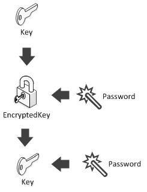

## Diagrams {#diagrams}

Most of the diagrams will have the same shape, they must be read by interpreting inward arrows like components to create the target:

For example, the following diagram should be read as  
```Key + Password = EncryptedKey```  
```EncryptedKey + Password = Key```  



Code is nice, but sometimes a picture is worth a thousand words. (Don’t worry, we’ll also write the code.)
