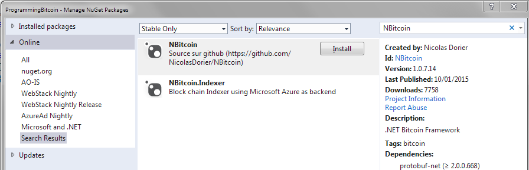
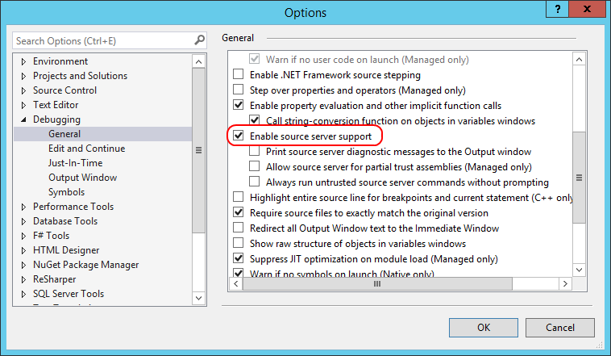

## Project Setup {#project-setup}

Before we begin with the instruction, we should describe how we expect your projects to be set up.

1.  Create a new Console Application Project in Visual Studio (.NET 4.5.2 or higher)
2.  Right click on the project in Solution Explorer and select “Manage NuGet Packages…”
3.  Search for “**NBitcoin”** and install it (or NBitcoin.Mono on MAC and Linux.)
  

> **Tip:** If you are on MAC or Linux and reference NBitcoin instead of NBitcoin.Mono you will be missing some classes.  

NBitcoin is the .NET Bitcoin library, it is open-source and maintained by Nicolas Dorier, the main author of this book.
This library should always be included if you do anything Bitcoin related in C#.  
NBitcoin supports cross-platform applications.  

## How to debug into NBitcoin source code (optional)  

NBitcoin lets you debug into its code to make your life easier. For this feature to work make sure you have source server support enabled in Visual Studio (Tools/Options -> Debugging/General -> Enable source server support).   
  

Now, if you step into NBitcoin's code, the source code will be automatically fetched from GitHub, and appear in the Visual Studio Debugger.  

# How to use in .NET Core

If you want to use .NET Core, first install .NET Core [as documented here](https://www.microsoft.com/net/core#windowsvs2017).

Then:
```
mkdir MyProject
cd MyProject
dotnet new console
dotnet add package NBitcoin
dotnet restore
```
Then edit your Program.cs:
```
using System;
using NBitcoin;

namespace _125350929
{
    class Program
    {
        static void Main(string[] args)
        {
            Console.WriteLine("Hello World! " + new Key().GetWif(Network.Main));
        }
    }
}
```
You can then run with
```
dotnet run
```
