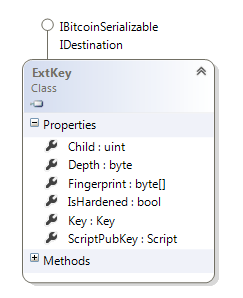
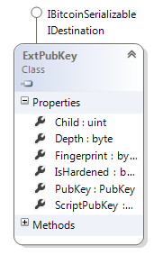
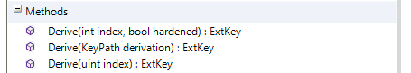
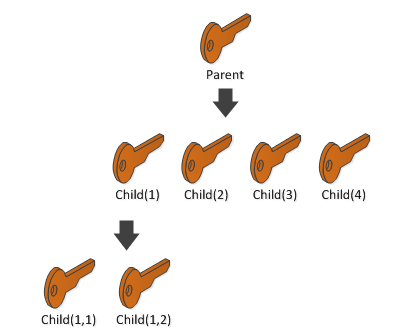
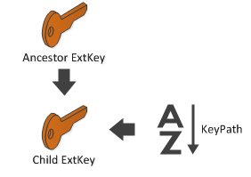
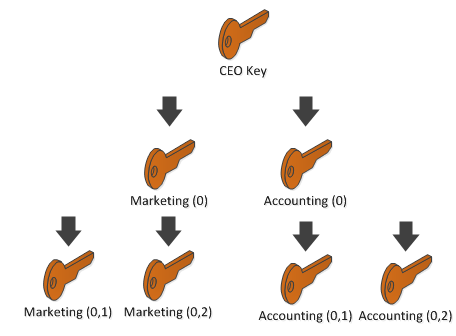
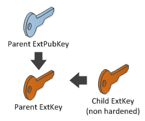

## HD Wallet (BIP 32) {#hd-wallet-bip-32}

Let’s keep in mind the problems that we want to resolve:

*   Prevent outdated backups.
*   Delegating key / address generation to an untrusted peer.

A “Deterministic” wallet would fix our backup problem. With such a wallet, you would have to save only the seed. From this seed, you can generate the same series of private keys over and over.

This is what the “Deterministic” stands for.
As you can see, from the master key, I can generate new keys:

```cs
ExtKey masterKey = new ExtKey();
Console.WriteLine("Master key : " + masterKey.ToString(Network.Main));
for (int i = 0; i < 5; i++)
{
    ExtKey key = masterKey.Derive((uint)i);
    Console.WriteLine("Key " + i + " : " + key.ToString(Network.Main));
}
```

```
Master key : xprv9s21ZrQH143K3JneCAiVkz46BsJ4jUdH8C16DccAgMVfy2yY5L8A4XqTvZqCiKXhNWFZXdLH6VbsCsqBFsSXahfnLajiB6ir46RxgdkNsFk
Key 0 : xprv9tvBA4Kt8UTuEW9Fiuy1PXPWWGch1cyzd1HSAz6oQ1gcirnBrDxLt8qsis6vpNwmSVtLZXWgHbqff9rVeAErb2swwzky82462r6bWZAW6Ty
Key 1 : xprv9tvBA4Kt8UTuHyzrhkRWh9xTavFtYoWhZTopNHGJSe3KomssRrQ9MTAhVWKFp4d7D8CgmT7TRzauoAZXp3xwHQfxr7FpXfJKpPDUtiLdmcF
Key 2 : xprv9tvBA4Kt8UTuLoEZPpW9fBEzC3gfTdj6QzMp8DzMbAeXgDHhSMmdnxSFHCQXycFu8FcqTJRm2kamjeE8CCKzbiXyoKWZ9ihiF7J5JicgaLU
Key 3 : xprv9tvBA4Kt8UTuPwJQyxuZoFj9hcEMCoz7DAWLkz9tRMwnBDiZghWePdD7etfi9RpWEWQjKCM8wHvKQwQ4uiGk8XhdKybzB8n2RVuruQ97Vna
Key 4 : xprv9tvBA4Kt8UTuQoh1dQeJTXsmmTFwCqi4RXWdjBp114rJjNtPBHjxAckQp3yeEFw7Gf4gpnbwQTgDpGtQgcN59E71D2V97RRDtxeJ4rVkw4E
Key 5 : xprv9tvBA4Kt8UTuTdiEhN8iVDr5rfAPSVsCKpDia4GtEsb87eHr8yRVveRhkeLEMvo3XWL3GjzZvncfWVKnKLWUMNqSgdxoNm7zDzzD63dxGsm
```

You only need to save the **masterKey**, since you can generate the same suite of private keys over and over.

As you can see, these keys are **ExtKey** and not **Key** as you are used to. However, this should not stop you since you have the real private key inside:



You can go back from a **Key** to an **ExtKey** by supplying the **Key** and the **ChainCode** to the **ExtKey** constructor. This works as follows:

```cs
ExtKey extKey = new ExtKey();
byte[] chainCode = extKey.ChainCode;
Key key = extKey.PrivateKey;

ExtKey newExtKey = new ExtKey(key, chainCode);
```

The **base58** type equivalent of **ExtKey** is called **BitcoinExtKey**.

But how can we solve our second problem: delegating address creation to a peer that can potentially be hacked (like a payment server)?

The trick is that you can “neuter” your master key, then you have a public (without private key) version of the master key. From this neutered version, a third party can generate public keys without knowing the private key.

```cs
ExtPubKey masterPubKey = masterKey.Neuter();
for (int i = 0 ; i < 5 ; i++)
{
    ExtPubKey pubkey = masterPubKey.Derive((uint)i);
    Console.WriteLine("PubKey " + i + " : " + pubkey.ToString(Network.Main));
}
```

```
PubKey 0 : xpub67uQd5a6WCY6A7NZfi7yGoGLwXCTX5R7QQfMag8z1RMGoX1skbXAeB9JtkaTiDoeZPprGH1drvgYcviXKppXtEGSVwmmx4pAdisKv2CqoWS
PubKey 1 : xpub67uQd5a6WCY6CUeDMBvPX6QhGMoMMNKhEzt66hrH6sv7rxujt7igGf9AavEdLB73ZL6ZRJTRnhyc4BTiWeXQZFu7kyjwtDg9tjRcTZunfeR
PubKey 2 : xpub67uQd5a6WCY6Dxbqk9Jo9iopKZUqg8pU1bWXbnesppsR3Nem8y4CVFjKnzBUkSVLGK4defHzKZ3jjAqSzGAKoV2YH4agCAEzzqKzeUaWJMW
PubKey 3 : xpub67uQd5a6WCY6HQKya2Mwwb7bpSNB5XhWCR76kRaPxchE3Y1Y2MAiSjhRGftmeWyX8cJ3kL7LisJ3s4hHDWvhw3DWpEtkihPpofP3dAngh5M
PubKey 4 : xpub67uQd5a6WCY6JddPfiPKdrR49KYEuXUwwJJsL5rWGDDQkpPctdkrwMhXgQ2zWopsSV7buz61e5mGSYgDisqA3D5vyvMtKYP8S3EiBn5c1u4
```

So imagine that your payment server generates pubkey1, you can get the corresponding private key with your private master key.

```cs
masterKey = new ExtKey();
masterPubKey = masterKey.Neuter();

//The payment server generate pubkey1
ExtPubKey pubkey1 = masterPubKey.Derive(1);

//You get the private key of pubkey1
ExtKey key1 = masterKey.Derive(1);

//Check it is legit
Console.WriteLine("Generated address : " + pubkey1.PubKey.GetAddress(ScriptPubKeyType.Legacy, Network.Main));
Console.WriteLine("Expected address : " + key1.PrivateKey.PubKey.GetAddress(ScriptPubKeyType.Legacy, Network.Main));
```

```
Generated address : 1Jy8nALZNqpf4rFN9TWG2qXapZUBvquFfX
Expected address : 1Jy8nALZNqpf4rFN9TWG2qXapZUBvquFfX
```

**ExtPubKey** is similar to **ExtKey** except that it holds a **PubKey** and not a **Key**.



Now we have seen how Deterministic keys solve our problems, let’s speak about what the “hierarchical” is for.

In the previous exercise, we have seen that by combining master key + index we could generate another key. We call this process **Derivation**, the master key is the **parent key**, and any generated keys are called **child keys**.

However, you can also derivate children from the child key. This is what the “hierarchical” stands for.

This is why conceptually more generally you can say: Parent Key + KeyPath => Child Key.






In this diagram, you can derivate Child(1,1) from parent in two different way:

```cs
ExtKey parent = new ExtKey();
ExtKey child11 = parent.Derive(1).Derive(1);
```

Or

```cs
ExtKey parent = new ExtKey();
ExtKey child11 = parent.Derive(new KeyPath("1/1"));
```

So in summary:



It works the same for **ExtPubKey**.

Why do you need hierarchical keys? Because it might be a nice way to classify the type of your keys for multiple accounts. More on [BIP44](https://github.com/bitcoin/bips/blob/master/bip-0044.mediawiki).

It also permits segmenting account rights across an organization.

Imagine you are CEO of a company. You want control over all wallets, but you don’t want the Accounting department to spend the money from the Marketing department.

So your first idea would be to generate one hierarchy for each department.



However, in such a case, **Accounting** and **Marketing** would be able to recover the CEO’s private key.

We define such child keys as **non-hardened**.



```cs
ExtKey ceoKey = new ExtKey();
Console.WriteLine("CEO: " + ceoKey.ToString(Network.Main));
ExtKey accountingKey = ceoKey.Derive(0, hardened: false);

ExtPubKey ceoPubkey = ceoKey.Neuter();

//Recover ceo key with accounting private key and ceo public key
ExtKey ceoKeyRecovered = accountingKey.GetParentExtKey(ceoPubkey);
Console.WriteLine("CEO recovered: " + ceoKeyRecovered.ToString(Network.Main));
```

```
CEO: xprv9s21ZrQH143K2XcJU89thgkBehaMqvcj4A6JFxwPs6ZzGYHYT8dTchd87TC4NHSwvDuexuFVFpYaAt3gztYtZyXmy2hCVyVyxumdxfDBpoC
CEO recovered: xprv9s21ZrQH143K2XcJU89thgkBehaMqvcj4A6JFxwPs6ZzGYHYT8dTchd87TC4NHSwvDuexuFVFpYaAt3gztYtZyXmy2hCVyVyxumdxfDBpoC
```

In other words, a **non-hardened key** can “climb” the hierarchy. **Non-hardened keys** should only be used for categorizing accounts that belongs to a point of **single control**.

So in our case, the CEO should create a **hardened key**, so the accounting department will not be able to climb the hierarchy.

```cs
ExtKey ceoKey = new ExtKey();
Console.WriteLine("CEO: " + ceoKey.ToString(Network.Main));
ExtKey accountingKey = ceoKey.Derive(0, hardened: true);

ExtPubKey ceoPubkey = ceoKey.Neuter();

ExtKey ceoKeyRecovered = accountingKey.GetParentExtKey(ceoPubkey); //Crash
```

You can also create hardened keys via the **ExtKey.Derivate**(**KeyPath)**, by using an apostrophe after a child’s index:

```cs
var nonHardened = new KeyPath("1/2/3");
var hardened = new KeyPath("1/2/3'");
```

So let’s imagine that the Accounting Department generates 1 parent key for each customer, and a child for each of the customer’s payments.

As the CEO, you want to spend the money on one of these addresses. Here is how you would proceed.

```cs
ceoKey = new ExtKey();
string accounting = "1'";
int customerId = 5;
int paymentId = 50;
KeyPath path = new KeyPath(accounting + "/" + customerId + "/" + paymentId);
//Path : "1'/5/50"
ExtKey paymentKey = ceoKey.Derive(path);
```