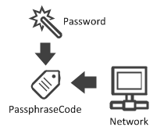
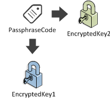
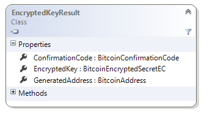
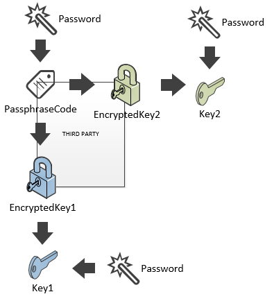

## BIP38 (Part 2) {#bip38-part-2}

We already looked at using BIP38 to encrypt a key, however this BIP is in reality two ideas in one document.

The second part of the BIP, shows how you can delegate Key and Address creation to an untrusted peer. It will fix one of our concerns.

**The idea is to generate a PassphraseCode to the key generator. With this PassphraseCode, they will be able to generate encrypted keys on your behalf, without knowing your password, nor any private key.**

This **PassphraseCode** can be given to your key generator in WIF format.

> **Tip**: In NBitcoin, all types prefixed by “Bitcoin” are Base58 (WIF) data.

So, as a user that wants to delegate key creation, first you will create the **PassphraseCode**.



```cs
var passphraseCode = new BitcoinPassphraseCode("my secret", Network.Main, null);
```

**You then give this passphraseCode to a third party key generator.**

The third party will then generate new encrypted keys for you.



```cs
EncryptedKeyResult encryptedKeyResult = passphraseCode.GenerateEncryptedSecret();
```

This **EncryptedKeyResult** has lots of information:



First: the **generated bitcoin address**,
```cs
var generatedAddress = encryptedKeyResult.GeneratedAddress; // 14KZsAVLwafhttaykXxCZt95HqadPXuz73
```
then the **EncryptedKey** itself (as we have seen in the previous, **Key Encryption** lesson),
```cs
var encryptedKey = encryptedKeyResult.EncryptedKey; // 6PnWtBokjVKMjuSQit1h1Ph6rLMSFz2n4u3bjPJH1JMcp1WHqVSfr5ebNS
```
and, last but not least, the **ConfirmationCode**, so that the third party can prove that the generated key and address correspond to your password.
```cs
var confirmationCode = encryptedKeyResult.ConfirmationCode; // cfrm38VUcrdt2zf1dCgf4e8gPNJJxnhJSdxYg6STRAEs7QuAuLJmT5W7uNqj88hzh9bBnU9GFkN
```

As the owner, once you receive this information, you need to check that the key generator did not cheat by using **ConfirmationCode.Check()**, then get your private key with your password:

```cs
Console.WriteLine(confirmationCode.Check("my secret", generatedAddress)); // True
var bitcoinPrivateKey = encryptedKey.GetSecret("my secret");
Console.WriteLine(bitcoinPrivateKey.GetAddress() == generatedAddress); // True
Console.WriteLine(bitcoinPrivateKey); // KzzHhrkr39a7upeqHzYNNeJuaf1SVDBpxdFDuMvFKbFhcBytDF1R
```

So, we have just seen how the third party can generate encrypted keys on your behalf, without knowing your password and private key.



However, one problem remains:

*   All backups of your wallet that you have will become outdated when you generate a new key.

BIP 32, or Hierarchical Deterministic Wallets (HD wallets) proposes another solution, which is more widely supported.