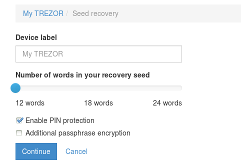
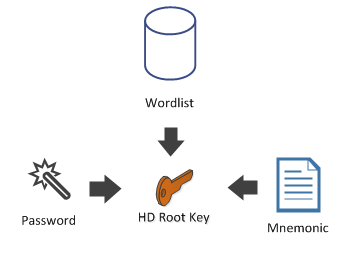

## Mnemonic Code for HD Keys (BIP39) {#mnemonic-code-for-hd-keys-bip39}

As you have seen, generating HD keys is easy. However, what if we want an easy way to transmit such a key by telephone or hand writing?

Cold wallets like Trezor, generate the HD Keys from a sentence that can easily be written down. They call such a sentence “the seed” or “mnemonic”. And it can eventually be protected by a password or a PIN.


The language that you use to generate your 'easy to write' sentence is called a **Wordlist**.


```cs
Mnemonic mnemo = new Mnemonic(Wordlist.English, WordCount.Twelve);
ExtKey hdRoot = mnemo.DeriveExtKey("my password");
Console.WriteLine(mnemo);
```

```minute put grant neglect anxiety case globe win famous correct turn link```

Now, if you have the mnemonic and the password, you can recover the **hdRoot** key.

```cs
mnemo = new Mnemonic("minute put grant neglect anxiety case globe win famous correct turn link",
                Wordlist.English);
hdRoot = mnemo.DeriveExtKey("my password");
```

Currently supported languages for **wordlist** are, English, Japanese, Spanish, Chinese (simplified and traditional).
