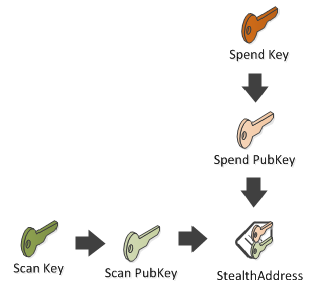
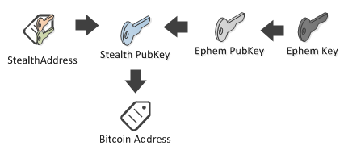
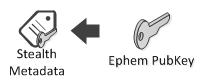
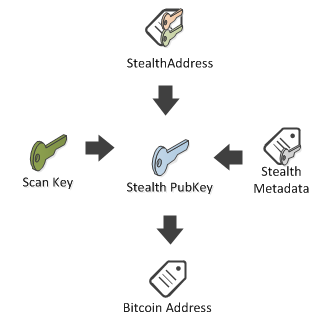
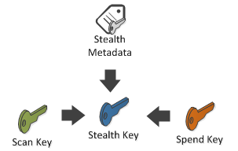

## Dark Wallet {#dark-wallet}

** WARNING: Dark Wallet is not really used anymore, this section is for pure curiosity **

Although Dark Wallets are not in use anymore, it is still valuable to understand the concepts presented here. Its name is unfortunate since there is nothing dark about it, and it attracts unwanted attention and concerns. Dark Wallet is a practical solution that fixes our two initial problems:

*   Prevent outdated backups.
*   Delegating key / address generation to an untrusted peer.

But it has a bonus killer feature.

You have to share only one address with the world (called **StealthAddress**), without leaking any privacy.

Let’s remind ourselves that if you share one **BitcoinAddress** with everybody, then all can see your balance by consulting the blockchain… That’s not the case with a **StealthAddress**.

It is a real shame that it was labeled as **dark** since it solves partially the important problem of privacy leaking caused by the pseudo-anonymity of Bitcoin. A better name would have been: **One Address**, because the Receiver of the coins needs to share only one address with the Payer. Using that address the Payer is able to generate many new addresses and the coins sent to these addresses will be spendable by the Receiver. Only the Payer and the Receiver know that these addresses are related, a third party investigating the public blockchain doesn't.

In Dark Wallet terminology, here are the different actors:

*   The **Payer** knows the **StealthAddress** of the **Receiver**.
*   The **Receiver** knows the **Spend Key**, a secret that will allow him to spend the coins he receives from such a transaction.
*   **Scanner** knows the **Scan Key**, a secret that allows him to detect the transactions that belong to the **Receiver**.

The rest is operational details. Underneath, this **StealthAddress** is composed of one or several **Spend PubKey**s (for multi sig), and one **Scan PubKey**.



```cs
var scanKey = new Key();
var spendKey = new Key();
BitcoinStealthAddress stealthAddress
    = new BitcoinStealthAddress
        (
        scanKey: scanKey.PubKey,
        pubKeys: new[] { spendKey.PubKey },
        signatureCount: 1,
        bitfield: null,
        network: Network.Main);
```

The **payer**, will take your **StealthAddress**, generate a temporary key called **Ephem Key** and will generate a **Stealth Pub Key**, from which the Bitcoin address to which the payment will be made is generated. Please note, that this Bitcoin address is a special base58 address which isn't recognized by the standard Bitcoin implementations like the Bitcoin Core.



Then, they will package the **Ephem PubKey** in a **Stealth Metadata** object embedded in the OP_RETURN of the transaction (as we did for the first challenge)

They will also add the output to the generated bitcoin address. (the address of the **Stealth pub key**)



```cs
var ephemKey = new Key();
Transaction transaction = Network.Main.CreateTransaction();
stealthAddress.SendTo(transaction, Money.Coins(1.0m), ephemKey);
Console.WriteLine(transaction);
```

The creation of the **EphemKey** is an implementation detail and you can omit it as NBitcoin will generate one automatically:

```cs
Transaction transaction = Network.Main.CreateTransaction();
stealthAddress.SendTo(transaction, Money.Coins(1.0m));
Console.WriteLine(transaction);
```

```json
{
  "hash": "7772b0ad19acd1bd2b0330238a898fe021486315bd1e15f4154cd3931a4940f9",
  "ver": 1,
  "vin_sz": 0,
  "vout_sz": 2,
  "lock_time": 0,
  "size": 93,
  "in": [],
  "out": [
    {
      "value": "0.00000000",
      "scriptPubKey": "OP_RETURN 060000000002b9266f15e8c6598e7f25d3262969a774df32b9b0b50fea44fc8d914c68176f3e"
    },
    {
      "value": "1.00000000",
      "scriptPubKey": "OP_DUP OP_HASH16051f68af989f5bf24259c519829f46c7f2935b756 OP_EQUALVERIFY OP_CHECKSIG"
    }
  ]
}
```

Then the payer adds and signs the inputs, then sends the transaction on the network.

The **Scanner** knowing the **StealthAddress** and the **Scan Key** can recover the **Stealth PubKey** and the expected **BitcoinAddress** payment.



Then the scanner checks if one of the outputs of the transaction corresponds to that address. If it does, then **Scanner** notifies the **Receiver** about the transaction.

The **Receiver** can then get the private key of the address with their **Spend Key**.



The code explaining how, as a Scanner, to scan a transaction and how, as a Receiver, to uncover the private key, will be explained later in the **TransactionBuilder** (Other types of ownership) section.

It should be noted that a **StealthAddress** can have multiple **spend pubkeys**, in which case, the address represents a multi sig.

One limit of Dark Wallet is the use of **OP_RETURN**, so we can’t easily embed arbitrary data in the transaction as we did in the **Bitcoin transfer** section. (Current bitcoin rules allows only one OP_RETURN of 80 bytes per transaction).

[Stackoverflow](http://bitcoin.stackexchange.com/a/29648/26859):
> As I understand it, the "stealth address" is intended to address a very specific problem. If you wish to solicit payments from the public, say by posting a donation address on your website, then everyone can see on the block chain that all those payments went to you, and perhaps try to track how you spend them.
>
With a stealth address, you ask payers to generate a unique address in such a way that you (using some additional data which is attached to the transaction) can deduce the corresponding private key. So although you publish a single "stealth address" on your website, the block chain sees all your incoming payments as going to separate addresses and has no way to correlate them. (Of course, any individual payer knows their payment went to you, and can trace how you spend it, but they don't learn anything about other people's payments to you.)
>
But you can get the same effect another way: just give each payer a unique address. Rather than posting a single public donation address on your website, have a button that generates a new unique address and saves the private key, or selects the next address from a long list of pre-generated addresses (whose private keys you hold somewhere safe). Just as before, the payments all go to separate addresses and there is no way to correlate them, nor for one payer to see that other payments went to you.
>
So the only difference with stealth addresses is essentially to move the chore of producing a unique address from the server to the client. Indeed, in some ways stealth addresses may be worse, since very few people use them, and if you are known to be one of them, it will be easier to connect stealth transactions with you.
>
It doesn't provide "100% anonymity". The fundamental anonymity weakness of Bitcoin remains - that everyone can follow the chain of payments, and if you know something about one transaction or the parties to it, you can deduce something about where those coins came from or where they went.
