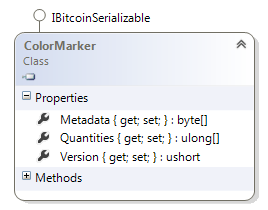
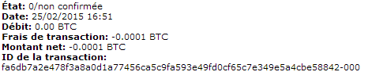
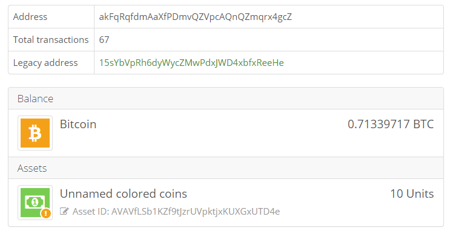

## Menerbitkan Aset {#issuing-an-asset}

### Penerbitan Koin {#issuance-coin}

Dalam Open Asset, ID aset berasal dari emiten **ScriptPubKey**.  
Jika anda ingin menerbitkan Colored Coin, anda perlu membuktikan kepemilikan **ScriptPubKey **tersebut. Dan satu-satunya cara untuk dapat melakukkan itu di Blockchain adalah dengan melakukan pengeluaran sejumlah koin pada **ScriptPubKey**.

Koin yang hendak dikeluarkan atau dibelanjakan untuk menerbitkan colored coins tersebut disebut dengan “**Issuance Coin**”. Di dalam **NBitcoin**.  
Misalkan saya ingin menerbitkan sebuah aset dari address bitcoin buku ini: [1KF8kUVHK42XzgcmJF4Lxz4wcL5WDL97PB](https://www.smartbit.com.au/address/1KF8kUVHK42XzgcmJF4Lxz4wcL5WDL97PB).

Melihat posisi balance address tersebut, lalu saya memutuskan menggunakan koin tersebut untuk menerbitkan aset.

```json
{
          "transactionId": "eb49a599c749c82d824caf9dd69c4e359261d49bbb0b9d6dc18c59bc9214e43b",
          "index": 0,
          "value": 2000000,
          "scriptPubKey": "76a914c81e8e7b7ffca043b088a992795b15887c96159288ac",
          "redeemScript": null
} 
```

Berikut bagaimana saya menerbitkan koin tersebut:

```cs
var coin = new Coin(
    fromTxHash: new uint256("eb49a599c749c82d824caf9dd69c4e359261d49bbb0b9d6dc18c59bc9214e43b"),
    fromOutputIndex: 0,
    amount: Money.Satoshis(2000000),
    scriptPubKey: new Script(Encoders.Hex.DecodeData("76a914c81e8e7b7ffca043b088a992795b15887c96159288ac")));

var issuance = new IssuanceCoin(coin);
```

Sekarang saya perlu membuat transaksi dan menandatangani dengan bantuan **TransactionBuilder**.

```cs
var nico = BitcoinAddress.Create("15sYbVpRh6dyWycZMwPdxJWD4xbfxReeHe");
var bookKey = new BitcoinSecret("???????");
TransactionBuilder builder = new TransactionBuilder();

var tx = builder
    .AddKeys(bookKey)
    .AddCoins(issuance)
    .IssueAsset(nico, new AssetMoney(issuance.AssetId, quantity: 10))
    .SendFees(Money.Coins(0.0001m))
    .SetChange(bookKey.GetAddress())
    .BuildTransaction(true);

Console.WriteLine(tx);
```

```json
{
  …
  "out": [
    {
      "value": "0.00000600",
      "scriptPubKey": "OP_DUP OP_HASH160 356facdac5f5bcae995d13e667bb5864fd1e7d59 OP_EQUALVERIFY OP_CHECKSIG"
    },
    {
      "value": "0.01989400",
      "scriptPubKey": "OP_DUP OP_HASH160 c81e8e7b7ffca043b088a992795b15887c961592 OP_EQUALVERIFY OP_CHECKSIG"
    },
    {
      "value": "0.00000000",
      "scriptPubKey": "OP_RETURN 4f410100010a00"
    }
  ]
}
```

Anda dapat melihat, bahwa disana termasuk juga sebuah output OP\_RETURN. Kenyataannya, itu adalah lokasi dimana informasi tentang colored coins berada.

Berikut adalah format data di dalam OP\_RETURN.



Dalam hal ini, kuantitasnya hanya 10, yang merupakan jumlah aset saya untuk dikeluarkan kepada`nico`. Metadata ini adalah data arbitrary. Kita akan melihat bahwa kita dapat menempatkan url pada sebuah “Asset Definition \(definisi aset\)”.  
**Asset Definition** adalah sebuah dokumen yang menjelaskan tentang aset tersebut. Karena hal itu sifatnya opsional, dan kita tidak menggunakannya.

Untuk bisa melihat detail informasi tersebut, anda bisa melihatnya di [Open Asset Specification](https://github.com/OpenAssets/open-assets-protocol/blob/master/specification.mediawiki).

Setelah transaksi diverifikasi, sekarang telah siap dikirimkan ke dalam jaringan.

```cs
Console.WriteLine(builder.Verify(tx)); 
```

### Dengan QBitNinja

```cs
var client = new QBitNinjaClient(Network.Main);
BroadcastResponse broadcastResponse = client.Broadcast(tx).Result;

if (!broadcastResponse.Success)
{
    Console.WriteLine("ErrorCode: " + broadcastResponse.Error.ErrorCode);
    Console.WriteLine("Error message: " + broadcastResponse.Error.Reason);
}
else
{
    Console.WriteLine("Success!");
}
```

### Atau dengan Bitcoin core

```cs
using (var node = Node.ConnectToLocal(Network.Main)) //Connect to the node
{
    node.VersionHandshake(); //Say hello
    //Advertize your transaction (send just the hash)
    node.SendMessage(new InvPayload(InventoryType.MSG_TX, tx.GetHash()));
    //Send it
    node.SendMessage(new TxPayload(tx));
    Thread.Sleep(500); //Wait a bit
}
```

Pada wallet bitcoin mempunyai keduanya address buku ini, dan address “Nico”.



Anda dapat melihat disana, pada Bitcoin Core hanya menunjukkan fee 0.0001 BTC yang saya bayarkan, dan mengabaikan 600 Satoshi karena untuk menghindari spam.

Wallet bitcoin kllasik ini tidak mengetahui apa-apa tentang Colored Coins.  
Lebih buruk lagi, jika pada wallet bitcoin klasik itu dapat menghancurkan aset dan transfer nilai bitcoin **TxOut**. \(600 satoshi\)

Untuk mencegah seorang pengguna mengirimkan Colored Coin kepada wallet yang tidak support, Open Asset mempunyai format address sendiri, sehingga wallet colored coin saja yang akan dapat mengerti dan bisa membaca.

```cs
nico = BitcoinAddress.Create("15sYbVpRh6dyWycZMwPdxJWD4xbfxReeHe");
Console.WriteLine(nico.ToColoredAddress());
```

```
akFqRqfdmAaXfPDmvQZVpcAQnQZmqrx4gcZ
```

Anda dapat melihat wallet Open Asset compatible seperti Coinprism, disana aset saya dapat dibaca secara tepat:



Seperti yang telah dikatakan sebelumnya, ID aset berasal dari emiten penerbit **ScriptPubKey**, dan ini bagaimana cara mendapatkannya: 

```cs
var book = BitcoinAddress.Create("1KF8kUVHK42XzgcmJF4Lxz4wcL5WDL97PB");
var assetId = new AssetId(book).GetWif(Network.Main);
Console.WriteLine(assetId); // AVAVfLSb1KZf9tJzrUVpktjxKUXGxUTD4e
```

