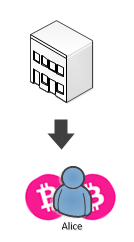
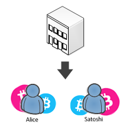
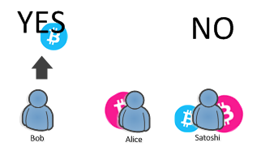

## Liquid Democracy {#liquid-democracy}

### Overview {#overview}

This part is a purely conceptual exercise of one application of colored coins.

Let’s imagine a company where some decisions are taken by a board of investors after a vote.

*   Some investors do not know enough about a topic, so they would like to delegate decisions about some subjects to someone else.
*   There is potentially a huge number of investors.
*   As the CEO, you want the ability to sell voting power for financing the company.
*   As the CEO, you want the ability to cast a vote when you decide.

How Colored Coins can help to organize such a vote transparently?

But before beginning, let’s talk about some downside of voting on the Blockchain:

*   Nobody knows the real identity of a voter.
*   Miners could censor (even if it would be provable, and not in their interest.)
*   Even if nobody knows the real identity of the voter, behavioral analysis of a voter across several vote might reveal his identity.

Whether these points are relevant or not is up to the vote organizer to decide.

Let’s take an overview of how we would implement that.

### Issuing voting power {#issuing-voting-power}

Everything start with the founder of the company (let’s call him Boss) wanting to sell “decision power” in his company to some investors. The decision power can take the shape of a colored coin that we will call for the sake of this exercise a “Power Coin”.

Let’s represent it in purple:  

  

Let’s say that three persons are interested, Satoshi, Alice and Bob. (Yes, them again)  
So Boss decides to sell each Power Coin at 0.1 BTC each.

Let’s start funding some money to the ```powerCoin``` address, ```satoshi```, ```alice``` and ```bob```.  

```cs
var powerCoin = new Key();
var alice = new Key();
var bob = new Key();
var satoshi = new Key();
var init = Network.Main.CreateTransaction();
init.Outputs.Add(Money.Coins(1.0m), powerCoin);
init.Outputs.Add(Money.Coins(1.0m), alice);
init.Outputs.Add(Money.Coins(1.0m), bob);
init.Outputs.Add(Money.Coins(1.0m), satoshi);

var repo = new NoSqlColoredTransactionRepository();
repo.Transactions.Put(init);
```  

Imagine that Alice buy 2 Power coins, here is how to create such transaction.  

  

```cs
var issuance = GetCoins(init,powerCoin)
                .Select(c=> new IssuanceCoin(c))
                .ToArray();
var builder = Network.Main.CreateTransaction();
var toAlice =
    builder
    .AddCoins(issuance)
    .AddKeys(powerCoin)
    .IssueAsset(alice, new AssetMoney(powerCoin, 2))
    .SetChange(powerCoin)
    .Then()
    .AddCoins(GetCoins(init, alice))
    .AddKeys(alice)
    .Send(alice, Money.Coins(0.2m))
    .SetChange(alice)
    .BuildTransaction(true);
repo.Transactions.Put(toAlice);
```  

In summary, powerCoin issues 2 Power Coins to Alice and send the change to himself. Likewise, Alice send 0.2 BTC to powerCoin and send the change to herself.

Where **GetCoins** is  

```cs
private IEnumerable<Coin> GetCoins(Transaction tx, Key owner)
{
    return tx.Outputs.AsCoins().Where(c => c.ScriptPubKey == owner.ScriptPubKey);
}
```  

For some reason, Alice, might want to sell some of her voting power to Satoshi.  

  

You can note that I am double spending the coin of Alice from the **init** transaction.  
****Such thing would not be accepted on the Blockchain. However, we have not seen yet how to retrieve unspent coins from the Blockchain easily, so let’s just imagine for the sake of the exercise that the coin was not double spent.

Now that Alice and Satoshi have some voting power, let’s see how Boss can run a vote.

### Running a vote {#running-a-vote}

By consulting the Blockchain, Boss can at any time know **ScriptPubKeys** which owns Power Coins.  
So he will send Voting Coins to these owner, proportionally to their voting power, in our case, 1 voting coin to Alice and 1 voting coin to Satoshi.  



First, I need to create some funds for **votingCoin**.  

```cs
var votingCoin = new Key();
var init2 = Network.Main.CreateTransaction();
init2.Outputs.Add(Money.Coins(1.0m), votingCoin);
repo.Transactions.Put(init2);
```  

Then, issue the voting coins.  

```cs
issuance = GetCoins(init2, votingCoin).Select(c => new IssuanceCoin(c)).ToArray();
builder = Network.CreateTransactionBuilder();
var toVoters =
    builder
    .AddCoins(issuance)
    .AddKeys(votingCoin)
    .IssueAsset(alice, new AssetMoney(votingCoin, 1))
    .IssueAsset(satoshi, new AssetMoney(votingCoin, 1))
    .SetChange(votingCoin)
    .BuildTransaction(true);
repo.Transactions.Put(toVoters);
```  

### Vote delegation {#vote-delegation}

The problem is that the vote concern some financial aspect of the business, and Alice is mostly concerned by the marketing aspect.

Her decision is to handout her voting coin to someone she trusts having a better judgment on financial matter. She chooses to delegate her vote to Bob.  

  

```cs
var aliceVotingCoin = ColoredCoin.Find(toVoters,repo)
                        .Where(c=>c.ScriptPubKey == alice.ScriptPubKey)
                        .ToArray();
builder = Network.Main.CreateTransactionBuilder();
var toBob =
    builder
    .AddCoins(aliceVotingCoin)
    .AddKeys(alice)
    .SendAsset(bob, new AssetMoney(votingCoin, 1))
    .BuildTransaction(true);
repo.Transactions.Put(toBob);
```  

You can notice that there is no **SetChange** the reason is that the input colored coin is spent entirely, so nothing is left to be returned.

### Voting {#voting}

Imagine that Satoshi is too busy and decide not to vote. Now Bob must express his decision.  
The vote concerns whether the company should ask for a loan to the bank for investing into new production machines.

Boss says on the company’s website:

Send your coins to 1HZwkjkeaoZfTSaJxDw6aKkxp45agDiEzN for yes and to 1F3sAm6ZtwLAUnj7d38pGFxtP3RVEvtsbV for no.

Bob decides that the company should take the loan:  

  

```cs
var bobVotingCoin = ColoredCoin.Find(toVoters, repo)
    .Where(c => c.ScriptPubKey == bob.ScriptPubKey)
    .ToArray();

builder = Network.Main.CreateTransactionBuilder();
var vote =
    builder
    .AddCoins(bobVotingCoin)
    .AddKeys(bob)
    .SendAsset(BitcoinAddress.Create("1HZwkjkeaoZfTSaJxDw6aKkxp45agDiEzN"),
                new AssetMoney(votingCoin, 1))
    .BuildTransaction(true);
```  

Now Boss can compute the result of the vote and see 1-Yes 0-No, Yes win, so he takes the loan.  
Every participants can also count the result by themselves.

### Alternative: Use of Ricardian Contract {#alternative-use-of-ricardian-contract}

In the previous exercise, we have supposed that Boss announced the modalities of the vote out of the Blockchain, on the company’s website.

This works great, but Bob need to know that the website exists.

Another solution is to publish the modalities of the vote directly on the Blockchain within an **Asset Definition File**, so some software can automatically get it and present it to Bob.

The only piece of code that would have changed is during the issuance of the Voting Coins to voters.  

```cs
issuance = GetCoins(init2, votingCoin).Select(c => new IssuanceCoin(c)).ToArray();
issuance[0].DefinitionUrl = new Uri("http://boss.com/vote01.json");
builder = Network.Main.CreateTransactionBuilder();
var toVoters =
    builder
    .AddCoins(issuance)
    .AddKeys(votingCoin)
    .IssueAsset(alice, new AssetMoney(votingCoin, 1))
    .IssueAsset(satoshi, new AssetMoney(votingCoin, 1))
    .SetChange(votingCoin)
    .BuildTransaction(true);
repo.Transactions.Put(toVoters);
```  

In such case, Bob can see that during the issuance of his voting coin, an **Asset Definition File** was published, which is nothing more than a JSON document whose schema is partially [specified in Open Asset](https://github.com/OpenAssets/open-assets-protocol/blob/master/asset-definition-protocol.mediawiki).The schema can be extended to have information about things like:

*   Expiration of the vote
*   Destination of the votes for each candidates
*   Human friendly description of it

However, imagine that a hacker wants to cheat the vote. He can always modify the json document (either man in the middle attack, physical access to boss.com, or access to Bob’s machine) so Bob is tricked and send his vote to the wrong candidate.

Transforming the **Asset Definition File** into a **Ricardian Contract** by signing it would make any modification immediately detectable by Bob’s software. (See [Proof Of Authenticity](https://github.com/OpenAssets/open-assets-protocol/blob/master/asset-definition-protocol.mediawiki) in the Asset Definition Protocol)