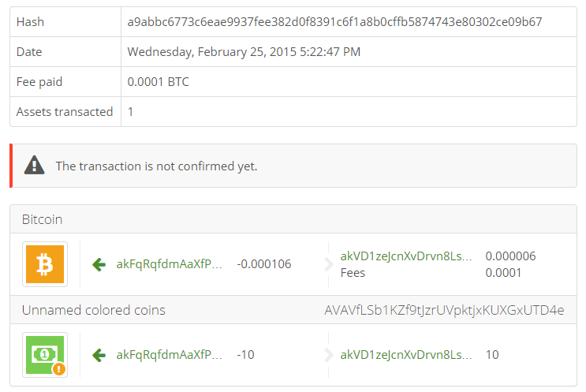

## Transfer an Asset {#transfer-an-asset}

So now, let’s imagine I sent you some **BlockchainProgramming Coins**.  
How can you send me back the coins?  
You need to build a **ColoredCoin**.

In the sample above, let’s say I want to spend the 10 assets I received on the address “nico”.  
Here is the coin I want to spend:  

```json
{
  "transactionId": "fa6db7a2e478f3a8a0d1a77456ca5c9fa593e49fd0cf65c7e349e5a4cbe58842",
  "index": 0,
  "value": 600,
  "scriptPubKey": "76a914356facdac5f5bcae995d13e667bb5864fd1e7d5988ac",
  "redeemScript": null,
  "assetId": "AVAVfLSb1KZf9tJzrUVpktjxKUXGxUTD4e",
  "quantity": 10
}
```  

Here is how to instantiate such Colored Coin in code:  

```cs
var coin = new Coin(
    fromTxHash: new uint256("fa6db7a2e478f3a8a0d1a77456ca5c9fa593e49fd0cf65c7e349e5a4cbe58842"),
    fromOutputIndex: 0,
    amount: Money.Satoshis(600),
    scriptPubKey: new Script(Encoders.Hex.DecodeData("76a914356facdac5f5bcae995d13e667bb5864fd1e7d5988ac")));
BitcoinAssetId assetId = new BitcoinAssetId("AVAVfLSb1KZf9tJzrUVpktjxKUXGxUTD4e");
ColoredCoin colored = coin.ToColoredCoin(assetId, 10);
```  

We will show you later how you can use some web services or custom code to get the coins more easily.  
I also needed another coin (forFees), to pay the fees.  
The asset transfer is actually very easy with the **TransactionBuilder**.

```cs
var book = BitcoinAddress.Create("1KF8kUVHK42XzgcmJF4Lxz4wcL5WDL97PB");
var nicoSecret = new BitcoinSecret("??????????", Network.Mainnet);
var nico = nicoSecret.GetAddress(); //15sYbVpRh6dyWycZMwPdxJWD4xbfxReeHe

var forFees = new Coin(
    fromTxHash: new uint256("7f296e96ec3525511b836ace0377a9fbb723a47bdfb07c6bc3a6f2a0c23eba26"),
    fromOutputIndex: 0,
    amount: Money.Satoshis(4425000),
    scriptPubKey: new Script(Encoders.Hex.DecodeData("76a914356facdac5f5bcae995d13e667bb5864fd1e7d5988ac")));

var builder = Network.Main.CreateTransactionBuilder();
var tx = builder
    .AddKeys(nicoSecret)
    .AddCoins(colored, forFees)
    .SendAsset(book, new AssetMoney(assetId, 10))
    .SetChange(nico)
    .SendFees(Money.Coins(0.0001m))
    .BuildTransaction(true);
Console.WriteLine(tx);
```  

```json
{
  ….
  "out": [
    {
      "value": "0.00000000",
      "scriptPubKey": "OP_RETURN 4f410100010a00"
    },
    {
      "value": "0.00000600",
      "scriptPubKey": "OP_DUP OP_HASH160 c81e8e7b7ffca043b088a992795b15887c961592 OP_EQUALVERIFY OP_CHECKSIG"
    },
    {
      "value": "0.04415000",
      "scriptPubKey": "OP_DUP OP_HASH160 356facdac5f5bcae995d13e667bb5864fd1e7d59 OP_EQUALVERIFY OP_CHECKSIG"
    }
  ]
}
```  

Which basically succeed:  

  
