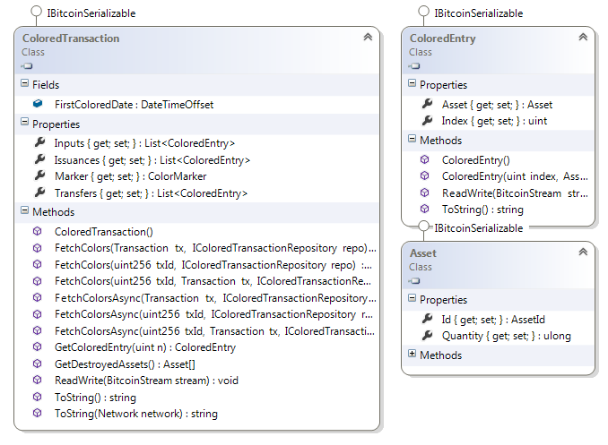
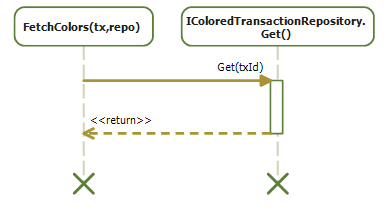
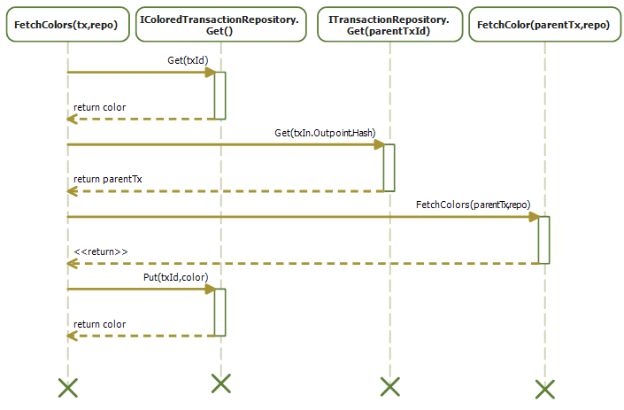

## Unit tests {#unit-tests}

You can see that previously I hard coded the properties of **ColoredCoin**.  
The reason is that I only wanted to show you how to construct a **Transaction** out of **ColoredCoin** coins.  

In real life, you would either depend on a third party API to fetch the colored coins of a transaction or a balance. Which might not be a good idea, because it add a trust dependency to your program with the API provider.  

**NBitcoin** allows you either to depend on a web service, either to provide your own implementation for fetching the color of a **Transaction**. This allows you to have a flexible way to unit test your code, use another implementation or your own.  

Let’s introduce two issuers: Silver and Gold. And three participants: Bob, Alice and Satoshi.  
Let’s create a fake transaction that gives some bitcoins to Silver, Gold and Satoshi.  

```cs
var gold = new Key();
var silver = new Key();
var goldId = gold.PubKey.ScriptPubKey.Hash.ToAssetId();
var silverId = silver.PubKey.ScriptPubKey.Hash.ToAssetId();

var bob = new Key();
var alice = new Key();
var satoshi = new Key();

var init = Network.Main.CreateTransaction();
init.Outputs.Add(Money.Coins(1.0m), gold);
init.Outputs.Add(Money.Coins(1.0m), silver);
init.Outputs.Add(Money.Coins(1.0m), satoshi);
```  

**Init** does not contain any Colored Coin issuance and Transfer. But imagine that you want to be sure of it, how would you proceed?  

In **NBitcoin**, the summary of color transfers and issuances is described by a class called **ColoredTransaction**.  



You can see that the **ColoredTransaction** class will tell you:

*   Which **TxIn** spends which Asset
*   Which **TxOut** emits which Asset
*   Which **TxOut** transfers which Asset

But the method that interests us right now is **FetchColor**, which will permit you to extract colored information out of the transaction you gave in input.  

You see that it depends on a **IColoredTransactionRepository**.  

  

**IColoredTransactionRepository** is only a store that will give you the **ColoredTransaction** from the txid. However you can see that it depends on **ITransactionRepository**, which maps a Transaction id to its transaction.  

An implementation of **IColoredTransactionRepository** is **CoinprismColoredTransactionRepository** which is a public API for colored coins operations.  
However, you can easily do your own, here is how **FetchColors** works.  

The simplest case is: The **IColoredTransactionRepository** knows the color, in such case **FetchColors** only returns that result.  

  

The second case is that the **IColoredTransactionRepository** does not know anything about the color of the transaction.  
So **FetchColors** will need to compute the color itself according to the open asset specification.  

However, for computing the color, **FetchColors** needs the color of the parent transactions.  
So it fetches each of them on the **ITransactionRepository**, and calls **FetchColors** on each of them.  
Once **FetchColors** has resolved the color of the parent’s recursively, it computes the transaction color, and caches the result back in the **IColoredTransactionRepository**.  

  

By doing that, future requests to fetch the color of a transaction will be resolved quickly.  
Some **IColoredTransactionRepository** are read-only (like **CoinprismColoredTransactionRepository** so the Put operation is ignored).

So, back to our example:
The trick when writing unit tests is to use an in memory **IColoredTransactionRepository**:  

```cs
var repo = new NoSqlColoredTransactionRepository();
```  

Now, we can put our **init** transaction inside.  

```cs
repo.Transactions.Put(init);
```  

Note that Put is an extension method, so you will need to add  

```cs
using NBitcoin.OpenAsset;
```  

at the top of the file to get access to it.  

And now, you can extract the color:  

```cs
ColoredTransaction color = ColoredTransaction.FetchColors(init, repo);
Console.WriteLine(color);
```  

```json
{
  "inputs": [],
  "issuances": [],
  "transfers": [],
  "destructions": []
}
```  

As expected, the **init** transaction has no inputs, issuances, transfers or destructions of Colored Coins.

So now, let’s use the two coins sent to Silver and Gold as Issuance Coins.

```cs
var issuanceCoins =
    init
    .Outputs
    .AsCoins()
    .Take(2)
    .Select((c, i) => new IssuanceCoin(c))
    .OfType<ICoin>()
    .ToArray();
```

Gold is the first coin, Silver the second one.

From that you can send Gold to Satoshi with the **TransactionBuilder**, as we have done in the previous exercise, and put the resulting transaction in the repository, and print the result.

```cs
{
  "inputs": [],
  "issuances": [
    {
      "index": 0,
      "asset": "ATEwaRSNeCgBjxjcur7JtfypFjqQgAtLJs",
      "quantity": 10
    }
  ],
  "transfers": [],
  "destructions": []
}
```  

This means that the first **TxOut** bears 10 gold.

Now imagine that **Satoshi** wants to send 4 gold to **Alice**.  
First, he will fetch the **ColoredCoin** out of the transaction.  

```cs
var goldCoin = ColoredCoin.Find(sendGoldToSatoshi, color).FirstOrDefault();
```  

Then, build a transaction like this:  

```cs
builder = Network.Main.CreateTransactionBuilder();
var sendToBobAndAlice =
        builder
        .AddKeys(satoshi)
        .AddCoins(goldCoin)
        .SendAsset(alice, new AssetMoney(goldId, 4))
        .SetChange(satoshi)
        .BuildTransaction(true);
```  

Except you will get the exception **NotEnoughFundsException**.  
The reason is that the transaction is composed of 600 satoshi in input (the **goldCoin**), and 1200 satoshi in output. (One **TxOut** for sending assets to Alice, and one for sending back the change to Satoshi.)

This means that you are short 600 satoshi.  
You can fix the problem by adding the last **Coin** of 1 BTC in the **init** transaction that belongs to **satoshi**.

```cs
var satoshiBtc = init.Outputs.AsCoins().Last();
builder = Network.Main.CreateTransactionBuilder();
var sendToAlice =
        builder
        .AddKeys(satoshi)
        .AddCoins(goldCoin, satoshiBtc)
        .SendAsset(alice, new AssetMoney(goldId, 4))
        .SetChange(satoshi)
        .BuildTransaction(true);
repo.Transactions.Put(sendToAlice);
color = ColoredTransaction.FetchColors(sendToAlice, repo);
```  

Let’s see the transaction and its colored part:

```cs
Console.WriteLine(sendToAlice);
Console.WriteLine(color);
```  

```json
{
  ….
  "in": [
    {
      "prev_out": {
        "hash": "46117f3ef44f2dfd87e0bc3f461f48fe9e2a3a2281c9b3802e339c5895fc325e",
        "n": 0
      },
      "scriptSig": "304502210083424305549d4bb1632e2c67736383558f3e1d7fb30ce7b5a3d7b87a53cdb3940220687ea53db678b467b98a83679dec43d27e89234ce802daf14ed059e7a09557e801 03e232cda91e719075a95ede4c36ea1419efbc145afd8896f36310b76b8020d4b1"
    },
    {
      "prev_out": {
        "hash": "aefa62270999baa0d57ddc7d2e1524dd3828e81a679adda810657581d7d6d0f6",
        "n": 2
      },
      "scriptSig": "30440220364a30eb4c8a82cc2a79c54d0518b8ba0cf4e49c73a5bbd17fe1a5683a0dfa640220285e98f3d336f1fa26fb318be545162d6a36ce1103c8f6c547320037cb1fb8e901 03e232cda91e719075a95ede4c36ea1419efbc145afd8896f36310b76b8020d4b1"
    }
  ],
  "out": [
    {
      "value": "0.00000000",
      "scriptPubKey": "OP_RETURN 4f41010002060400"
    },
    {
      "value": "0.00000600",
      "scriptPubKey": "OP_DUP OP_HASH160 5bb41cd29f4e838b4b0fdcd0b95447dcf32c489d OP_EQUALVERIFY OP_CHECKSIG"
    },
    {
      "value": "0.00000600",
      "scriptPubKey": "OP_DUP OP_HASH160 469c5243cb08c82e78a8020360a07ddb193f2aa8 OP_EQUALVERIFY OP_CHECKSIG"
    },
    {
      "value": "0.99999400",
      "scriptPubKey": "OP_DUP OP_HASH160 5bb41cd29f4e838b4b0fdcd0b95447dcf32c489d OP_EQUALVERIFY OP_CHECKSIG"
    }
  ]
}
Colored :
{
  "inputs": [
    {
      "index": 0,
      "asset": " ATEwaRSNeCgBjxjcur7JtfypFjqQgAtLJs ",
      "quantity": 10
    }
  ],
  "issuances": [],
  "transfers": [
    {
      "index": 1,
      "asset": " ATEwaRSNeCgBjxjcur7JtfypFjqQgAtLJs ",
      "quantity": 6
    },
    {
      "index": 2,
      "asset": " ATEwaRSNeCgBjxjcur7JtfypFjqQgAtLJs ",
      "quantity": 4
    }
  ],
  "destructions": []
}
```  

We have finally made a unit test that emits and transfers some assets without any external dependencies.  

You can make your own **IColoredTransactionRepository** if you don’t want to depend on a third party service.

You can find more complex scenarios in [NBitcoin tests](https://github.com/NicolasDorier/NBitcoin/blob/master/NBitcoin.Tests/transaction_tests.cs), and also in one of my articles “[Build them all](http://www.codeproject.com/Articles/835098/NBitcoin-Build-Them-All)” in codeproject. (Like multi sig issuance and colored coin swaps.)