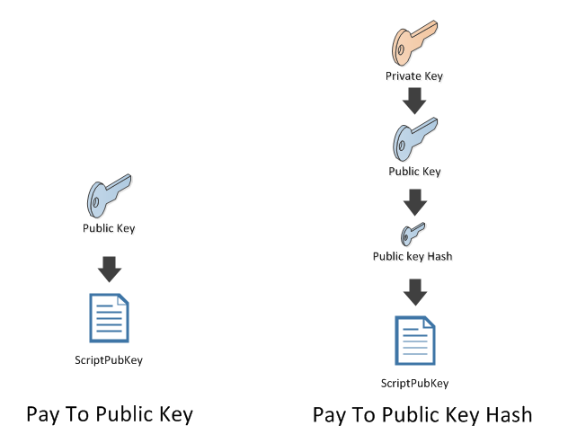

## P2PK[H] \(Pay to Public Key [Hash]\) {#p2pk-h-pay-to-public-key-hash}

### P2PKH - Quick recap
We learned that a **Bitcoin Address** was the **hash of a** **public key**:  

```cs
var publicKeyHash = new Key().PubKey.Hash;
var bitcoinAddress = publicKeyHash.GetAddress(Network.Main);
Console.WriteLine(publicKeyHash); // 41e0d7ab8af1ba5452b824116a31357dc931cf28
Console.WriteLine(bitcoinAddress); // 171LGoEKyVzgQstGwnTHVh3TFTgo5PsqiY
```  

We also learned that as far as the blockchain is concerned, there is no such thing as a **bitcoin address**. The blockchain identifies a receiver with a **ScriptPubKey**, and that a **ScriptPubKey** could be generated from the address:  

```cs
var scriptPubKey = bitcoinAddress.ScriptPubKey;
Console.WriteLine(scriptPubKey); // OP_DUP OP_HASH160 41e0d7ab8af1ba5452b824116a31357dc931cf28 OP_EQUALVERIFY OP_CHECKSIG
```  

And vice versa:  

```cs
var sameBitcoinAddress = scriptPubKey.GetDestinationAddress(Network.Main);
```

### P2PK

However, not all **ScriptPubKey** represent a Bitcoin Address. For example the first transaction in the first ever blockchain block, called the genesis block:  

```cs
Block genesisBlock = Network.Main.GetGenesis();
Transaction firstTransactionEver = genesisBlock.Transactions.First();
var firstOutputEver = firstTransactionEver.Outputs.First();
var firstScriptPubKeyEver = firstOutputEver.ScriptPubKey;
var firstBitcoinAddressEver = firstScriptPubKeyEver.GetDestinationAddress(Network.Main);
Console.WriteLine(firstBitcoinAddressEver == null); // True
```  

```cs
Console.WriteLine(firstTransactionEver);
```  

```json
{
…
  "out": [
    {
      "value": "50.00000000",
      "scriptPubKey": "04678afdb0fe5548271967f1a67130b7105cd6a828e03909a67962e0ea1f61deb649f6bc3f4cef38c4f35504e51ec112de5c384df7ba0b8d578a4c702b6bf11d5f OP_CHECKSIG"
    }
  ]
}
```  

You can see that the form of the **scriptPubKey** is different:  

```cs
Console.WriteLine(firstScriptPubKeyEver); // 04678afdb0fe5548271967f1a67130b7105cd6a828e03909a67962e0ea1f61deb649f6bc3f4cef38c4f35504e51ec112de5c384df7ba0b8d578a4c702b6bf11d5f OP_CHECKSIG
```

A bitcoin address is represented by: **OP_DUP OP_HASH160 &lt;hash&gt; OP_EQUALVERIFY OP_CHECKSIG**

But here we have: **&lt;pubkey&gt; OP_CHECKSIG**

In fact, at the beginning, **public key**s were used directly in the **ScriptPubKey**.  

```cs
var firstPubKeyEver = firstScriptPubKeyEver.GetDestinationPublicKeys().First();
Console.WriteLine(firstPubKeyEver); // 04678afdb0fe5548271967f1a67130b7105cd6a828e03909a67962e0ea1f61deb649f6bc3f4cef38c4f35504e51ec112de5c384df7ba0b8d578a4c702b6bf11d5f
```

Now we are mainly using the hash of the public key.  

  

```cs
key = new Key();
Console.WriteLine("Pay to public key : " + key.PubKey.ScriptPubKey);
Console.WriteLine();
Console.WriteLine("Pay to public key hash : " + key.PubKey.Hash.ScriptPubKey);
```  

``` 
Pay to public key : 02fb8021bc7dedcc2f89a67e75cee81fedb8e41d6bfa6769362132544dfdf072d4 OP_CHECKSIG
Pay to public key hash : OP_DUP OP_HASH160 0ae54d4cec828b722d8727cb70f4a6b0a88207b2 OP_EQUALVERIFY OP_CHECKSIG
```  

These 2 types of payment are referred as **P2PK** (pay to public key) and **P2PKH** (pay to public key hash).

Satoshi later decided to use P2PKH instead of P2PK for two reasons:

*   Elliptic Curve Cryptography (the cryptography used by your **public key** and **private key**) is vulnerable to a modified Shor's algorithm for solving the discrete logarithm problem on elliptic curves. In plain English, it means that in the future a quantum computer might be able to **retrieve a private key from a public key**. By publishing the public key only when the coins are spent (and assuming that addresses are not reused), such an attack is rendered ineffective. 
*   With the hash being smaller (20 bytes) it is easier to print and easier to embed into small storage mediums like QR codes.

Nowadays, there is no reason to use P2PK directly although it is still used in combination with P2SH... more on this later.  

> ([Discussion](https://www.reddit.com/r/Bitcoin/comments/4isxjr/petition_to_protect_satoshis_coins/d30we6f)) If the issue of the early use of P2PK is not addressed it will have a serious impact on the Bitcoin price.  

### Exercise
([nopara73](https://github.com/nopara73)) While reading this chapter I found the the abbreviations (P2PK, P2PKH, P2W, etc..) very confusing.  
My trick was to force myself to pronounce the terms fully every time I encountered them during the following lessons. Suddenly everything made much more sense. I recommend you to do the same.
