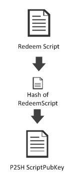
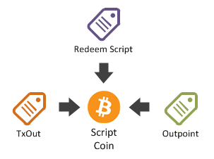

## P2SH (Pay To Script Hash) {#p2sh-pay-to-script-hash}

As seen in the previous section, using multi-sig is easily done in code. However, before P2SH there was no way to ask someone to pay to a multi-sig ```scriptPubKey``` in a way that was as simple as just providing them with a regular ```BitcoinAddress```.  

**Pay To Script Hash** (or **P2SH** as it is often known), is an easy way to represent a ```scriptPubKey``` as a simple ```BitcoinScriptAddress```, no matter how complicated it is in terms of it's underlying m-of-n signature set up.

In the previous part we generated this multi-sig:

```cs
Key bob = new Key();
Key alice = new Key();
Key satoshi = new Key();

var scriptPubKey = PayToMultiSigTemplate
    .Instance
    .GenerateScriptPubKey(2, new[] { bob.PubKey, alice.PubKey, satoshi.PubKey });

Console.WriteLine(scriptPubKey);
```  

```
2 0282213c7172e9dff8a852b436a957c1f55aa1a947f2571585870bfb12c0c15d61 036e9f73ca6929dec6926d8e319506cc4370914cd13d300e83fd9c3dfca3970efb 0324b9185ec3db2f209b620657ce0e9a792472d89911e0ac3fc1e5b5fc2ca7683d 3 OP_CHECKMULTISIG
```  

Complicated isn’t it?

Instead, let’s see how such a ```scriptPubKey``` would look in a **P2SH** payment.

```cs
Key bob = new Key();
Key alice = new Key();
Key satoshi = new Key();

var paymentScript = PayToMultiSigTemplate
    .Instance
    .GenerateScriptPubKey(2, new[] { bob.PubKey, alice.PubKey, satoshi.PubKey }).PaymentScript;

Console.WriteLine(paymentScript);
```  

```
OP_HASH160 57b4162e00341af0ffc5d5fab468d738b3234190 OP_EQUAL
```  

Do you see the difference? This P2SH ```scriptPubKey``` represents the hash of the multi-sig script: ```redeemScript.Hash.ScriptPubKey```

Since it is a hash, you can easily convert it to a base58 string ```BitcoinScriptAddress```.

```cs
Key bob = new Key();
Key alice = new Key();
Key satoshi = new Key();

Script redeemScript =
    PayToMultiSigTemplate
    .Instance
    .GenerateScriptPubKey(2, new[] { bob.PubKey, alice.PubKey, satoshi.PubKey });
//Console.WriteLine(redeemScript.Hash.ScriptPubKey);
Console.WriteLine(redeemScript.Hash.GetAddress(Network.Main)); // 3E6RvwLNfkH6PyX3bqoVGKzrx2AqSJFhjo
```  

Such an address will still be understood by any existing client wallet, even if the wallet does not understand what “multi-sig” is.

In P2SH payments, we refer to the hash of the **Redeem Script** as the ```scriptPubKey```.  

  

Since anyone sending a payment to such an address only sees the **Hash of the RedeemScript**, and do not know the **Redeem Script** itself, they don’t even have to know that they are sending money to a multi sig of Alice/Bob/Satoshi.  

Signing such a transaction is similar to what we have done before. The only difference is that you also have to provide the **Redeem Script** when you build the Coin for the **TransactionBuilder**.

Imagine that the multi-sig P2SH receives a coin in a transaction called ```received```.  

```cs
Script redeemScript =
    PayToMultiSigTemplate
    .Instance
    .GenerateScriptPubKey(2, new[] { bob.PubKey, alice.PubKey, satoshi.PubKey });
////Console.WriteLine(redeemScript.Hash.ScriptPubKey);
//Console.WriteLine(redeemScript.Hash.GetAddress(Network.Main));
            
Transaction received = Transaction.Create(Network.Main)
//Pay to the script hash
received.Outputs.Add(Money.Coins(1.0m), redeemScript.Hash);
```  

> Warning: The payment is sent to ```redeemScript.Hash``` and not to ```redeemScript```!  

When any two owners out of the three that control the multi-sig address (Alice/Bob/Satoshi) then want to spend what they have received, instead of creating a ```Coin``` they will need to create a ```ScriptCoin```.  

```cs
//Give the redeemScript to the coin for Transaction construction
//and signing
ScriptCoin coin = received.Outputs.AsCoins().First()
                                    .ToScriptCoin(redeemScript);
```  

  

The rest of the code concerning transaction generation and signing is exactly the same as in the previous section about native multi sig.
