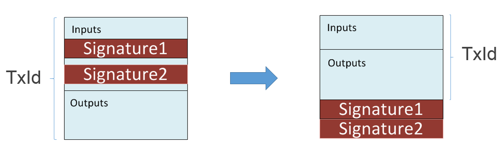

## P2WPKH (Pay to Witness Public Key Hash) {#p2wpkh-pay-to-witness-public-key-hash}

In 2015, Pieter Wuille introduced a new feature to bitcoin called **Segregated Witness**, also known by it's abbreviated name, **Segwit**. Basically, Segregated Witness moves the proof of ownership from the **scriptSig** part of the transaction to a new part called the **witness** of the input.

There are several reasons why it is beneficial to use this new scheme, a summary of which are presented below. For more details visit [https://bitcoincore.org/en/2016/01/26/segwit-benefits/](https://bitcoincore.org/en/2016/01/26/segwit-benefits/).

*   **Third party Malleability Fix:** Previously, a third party could change the transaction id of your transaction before it was confirmed. This can not occur under Segwit.
*   **Linear sig hash scaling:** Signing a transaction used to require hashing the whole transaction for every input. This was a potential DDoS vector attack for large transactions.
*   **Signing of input values:** The amount that is spent in an input is also signed, meaning that the signer can’t be tricked about the amount of fees that are actually being paid.
*   **Capacity increase:** It will now be possible to have more than 1MB of transactions in each block (which are created every 10 minutes on average). Segwit increases this capacity by a factor of about 2.1, based upon the average transaction profile from November 2016.
*   **Fraud proof:** Will be developed later, but Simple Payment Verification (SPV) wallets will be able to validate more consensus rules rather than just simply following the longest chain.

Before Sewgit the transaction signature was used in the calculation of the transaction id.  



The signature contains the same information as a P2PKH spend, but is located in the witness instead of the scriptSig. The ```scriptPubKey``` though, is modified from  

```
OP_DUP OP_HASH160 0067c8970e65107ffbb436a49edd8cb8eb6b567f OP_EQUALVERIFY OP_CHECKSIG
```  

To  

```
0 0067c8970e65107ffbb436a49edd8cb8eb6b567f
```  

For nodes which did not upgrade, this looks like two pushes on the stack. This means that any ```scriptSig``` can spend them. So even without the signatures, old nodes will consider such transactions valid. New nodes interpret the first push as the **witness version** and the second push as the **witness program**.  

New nodes will therefore also require the signature in order to verify the transaction.  

**In NBitcoin, spending a P2WPKH output is no different from spending a normal P2PKH.  
To get the ```ScriptPubKey``` from a public key simply use ```PubKey.WitHash``` instead of ```PubKey.Hash```.**

```cs
var key = new Key();
Console.WriteLine(key.PubKey.WitHash.ScriptPubKey);
```  

Which will output something like  

```
0 0067c8970e65107ffbb436a49edd8cb8eb6b567f
```  

Signing the spending of such coins will be explained later in the “Using the ```TransactionBuilder```" section, and does not differ in any way from the code used to sign a P2PKH output.

The ```witness``` data is similar to the ```scriptSig``` of P2PKH, and the ```scriptSig``` data is empty:  

```json
"in": [
{
  "prev_out": 
    {
      "hash": "725497eaef527567a0a18b310bbdd8300abe86f82153a39d2f87fef713dc8177",
      "n": 0
    },
  "scriptSig": "",
  "witness": "3044022079d443be2bd39327f92adf47a34e4b6ad7c82af182c71fe76ccd39743ced58cf0220149de3e8f11e47a989483f371d3799a710a7e862dd33c9bd842c417002a1c32901 0363f24cd2cb27bb35eb2292789ce4244d55ce580218fd81688197d4ec3b005a67"
}
```  

Once again, the semantics of P2WPKH is the same as the semantics of P2PKH, except that the signature is not placed at the same location as before.
