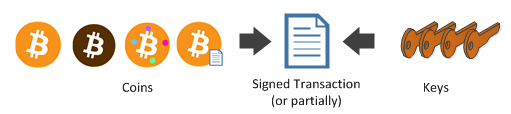
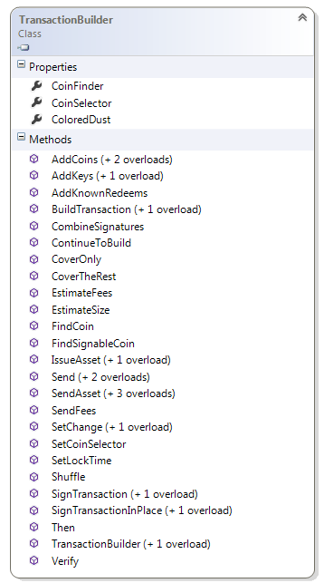
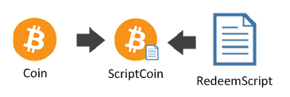
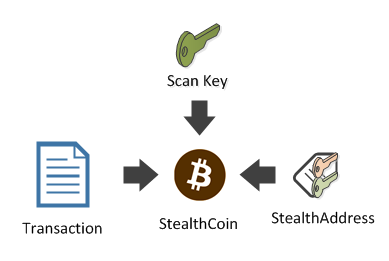

## Using the TransactionBuilder {#using-the-transactionbuilder}

You have seen how the **TransactionBuilder** works when you have signed your first **P2SH** and **multi-sig** transaction.  

We will see how you can harness its full power, for signing more complicated transactions.    

With the **TransactionBuilder** you can:  
*   Spend any  
  *   **P2PK**, **P2PKH**,  
  *   **multi-sig**,  
  *   **P2WPK**, **P2WSH**.  
*   Spend any **P2SH** on the previous redeem script.  
*   Spend **Stealth Coin** (DarkWallet).  
*   Issue and transfer **Colored Coins** (open asset, following chapter).  
*   Combine **partially signed transactions**.  
*   Estimate the final **size** of an **unsigned transaction** and its **fees**.  
*   Verify if a **transaction** is **fully signed**.  

The goal of the **TransactionBuilder** is to take **Coins** and **Keys** as input, and return back a **signed** or **partially signed transaction**.  

  

The **TransactionBuilder** will figure out what **Coin** to use and what to sign by itself.  

  

The usage of the builder is done in four steps:  
*   You gather the **Coins** that will be spent,
*   You gather the **Keys** that you own,
*   You enumerate how much **Money** you want to send to what **scriptPubKey**,
*   You build and sign the **transaction**,
*   **Optional**: you give the **transaction** to somebody else, then he will sign or continue to build it.

Now let’s gather some **Coins**. For that, let us create a fake **transaction** with some funds on it.  
Let’s say that the **transaction** has a **P2PKH**, **P2PK**, and **multi-sig** coin of Bob and Alice.

```cs
// Create a fake transaction
var bob = new Key();
var alice = new Key();

Script bobAlice = 
    PayToMultiSigTemplate.Instance.GenerateScriptPubKey(
        2, 
        bob.PubKey, alice.PubKey);

var init = Network.Main.CreateTransaction();
init.Outputs.Add(Money.Coins(1m), bob.PubKey); // P2PK
init.Outputs.Add(Money.Coins(1m), alice.PubKey.Hash); // P2PKH
init.Outputs.Add(Money.Coins(1m), bobAlice);
```

Now let’s say they want to use the ```coins``` of this transaction to pay Satoshi.  

```cs
var satoshi = new Key();
```  

First they have to get their **Coins**.  

```cs
Coin[] coins = init.Outputs.AsCoins().ToArray();
Coin bobCoin = coins[0];
Coin aliceCoin = coins[1];
Coin bobAliceCoin = coins[2];
```  

Now let’s say ```bob``` wants to send 0.2 BTC, ```alice``` 0.3 BTC, and they agree to use ```bobAlice``` to send 0.5 BTC.  

```cs
var builder = Network.Main.CreateTransactionBuilder();
Transaction tx = builder
        .AddCoins(bobCoin)
        .AddKeys(bob)
        .Send(satoshi, Money.Coins(0.2m))
        .SetChange(bob)
        .Then()
        .AddCoins(aliceCoin)
        .AddKeys(alice)
        .Send(satoshi, Money.Coins(0.3m))
        .SetChange(alice)
        .Then()
        .AddCoins(bobAliceCoin)
        .AddKeys(bob, alice)
        .Send(satoshi, Money.Coins(0.5m))
        .SetChange(bobAlice)
        .SendFees(Money.Coins(0.0001m))
        .BuildTransaction(sign: true);
```  

Then you can verify it is fully signed and ready to send to the network.  

```cs
Console.WriteLine(builder.Verify(tx)); // True
```  

The nice thing about this model is that it works the same way for **P2SH, P2WSH, P2SH(P2WSH)**, and **P2SH(P2PKH)** except you need to create **ScriptCoin**.  

  

```cs
init = Network.Main.CreateTransaction();
init.Outputs.Add(Money.Coins(1.0m), bobAlice.Hash);

coins = init.Outputs.AsCoins().ToArray();
ScriptCoin bobAliceScriptCoin = coins[0].ToScriptCoin(bobAlice);
```  

Then the signature:  

```cs
builder = Network.Main.CreateTransactionBuilder();
tx = builder
        .AddCoins(bobAliceScriptCoin)
        .AddKeys(bob, alice)
        .Send(satoshi, Money.Coins(0.9m))
        .SetChange(bobAlice.Hash)
        .SendFees(Money.Coins(0.0001m))
        .BuildTransaction(true);
Console.WriteLine(builder.Verify(tx)); // True
```  

For **Stealth Coin**, this is basically the same thing. Except that, if you remember our introduction on Dark Wallet, I said that you need a **ScanKey** to see the **StealthCoin**.

  

Let’s create darkAliceBob stealth address as in previous chapter:  

```cs
Key scanKey = new Key();
BitcoinStealthAddress darkAliceBob =
    new BitcoinStealthAddress
        (
            scanKey: scanKey.PubKey,
            pubKeys: new[] { alice.PubKey, bob.PubKey },
            signatureCount: 2,
            bitfield: null,
            network: Network.Main
        );
```  

Let’s say someone sent this transaction:  

```cs
//Someone sent to darkAliceBob
init = Network.Main.CreateTransaction();
darkAliceBob
    .SendTo(init, Money.Coins(1.0m));
```  

The scanner will detect the StealthCoin:  

```cs
//Get the stealth coin with the scanKey
StealthCoin stealthCoin
    = StealthCoin.Find(init, darkAliceBob, scanKey);
```  

And forward it to bob and alice, who will sign:  

```cs
//Spend it
tx = builder
        .AddCoins(stealthCoin)
        .AddKeys(bob, alice, scanKey)
        .Send(satoshi, Money.Coins(0.9m))
        .SetChange(bobAlice.Hash)
        .SendFees(Money.Coins(0.0001m))
        .BuildTransaction(true);
Console.WriteLine(builder.Verify(tx)); // True
```  

> **Note:** You need the scanKey for spending a StealthCoin
