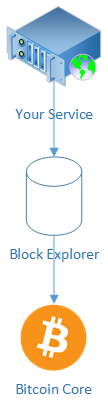

# Web API/ Block Explorer {#web-api}

Block explorers, or more specifically the web APIs, usually provided by block explorers can get you started very quickly. You used `QBitNinja` already in this book, but many more exist.  
A block explorer is a self-hosted or third-party hosted solution which provides you information about blocks, transactions and addresses in the chain.  



A block explorer connects to a bitcoin node, indexes the data of the blockchain and exposes an easy to use API.
Solutions include: `QBitNinja`, `Blockcypher`, `Smartbit`, `Electrum server`, `Insight`, `NBXplorer`.  

The advantages are:

* Better API than Bitcoin Core RPC,
* Can handle more load,
* Support large number of wallet, and can add them dynamically,
* The client-server architecthure is fast.  

The disadvantages are:

* If it is hosted by third party, and there is a contentious fork, you don't have the choice of which fork to follow,
* Sometimes, their services are not enough to handle everything you need for a full wallet,
* Non-existent privacy: the server knows everything about the clients. This doesn't apply to self-hosted type.

Different block explorers expose different APIs and features. For example most block explorers use HTTP web APIs, while Electrum uses [the Stratum](http://docs.electrum.org/en/latest/protocol.html) protocol. Block explorers never have the private keys of the wallet.  

With `QBitNinja`, it is difficult to track a wallet which always changes addresses, because you need to poll all the addresses belonging to the same wallet to detect any change. 

However, `Electrum` or `NBXplorer` and `SmartBit` exposes notifications via websockets or long polling so you don't need to poll all the addresses of the wallet.  
`Insight` is not well maintained. `Blockcypher`, `QBitNinja` and `Smartbit` are third-party hosted. If you are interested in building a wallet such way take a look at nopara73's CodeProject article: [Build your own Bitcoin wallet with QBitNinja in C#](https://www.codeproject.com/Articles/1115639/Build-your-own-Bitcoin-wallet).  

[NBxplorer](https://github.com/dgarage/NBXplorer/) has been created to have a very simple API, is self hostable, and tracks only what is needed for your wallet. 
Contrary to `QBitNinja`, it relies on you having a full node, but it provides websocket notifications and an easy way to query the balances of a wallet. 

NBXplorer is also multi crypto currency on a single server. As of October 2018, it supports Bitcoin, Litecoin, BCash, 
BGold, Dash, Dogecoin, Dystem, Feathercoin, Groestlcoin, Monacoin, Polis, UFO, Viacoin and Zclassic.
It integrates seamlessly with `NBitcoin`.

To setup NBXplorer, you need a fully synced `bitcoind` node with default parameters.  
Then clone and run [NBXplorer](https://github.com/dgarage/NBXplorer) with default parameters.

Reference the `NBXplorer.Client` nuget package then you need to notify the `NBXplorer` to track the user wallet:

```cs
var network = new NBXplorerNetworkProvider(NetworkType.Mainnet).GetBTC();
var userExtKey = new ExtKey();
var userDerivationScheme = network.DerivationStrategyFactory.CreateDirectDerivationStrategy(userExtKey.Neuter(), new DerivationStrategyOptions()
{
	// Use non-segwit
	Legacy = true
});
ExplorerClient client = new ExplorerClient(network);
client.Track(userDerivationScheme);
```

Change `NetworkType.Mainnet` if you want to use Testnet or Regtest.

If you want a new unused address:

```cs
Console.WriteLine(client.GetUnused(userDerivationScheme, DerivationFeature.Deposit).Address);
```

Then you can query the UTXOs of your user and spend them the following way:

```cs
var utxos = client.GetUTXOs(userDerivationScheme, null, false);
```

If you want to spend those UTXOs:

```cs
var coins = utxos.GetUnspentCoins();
var keys = utxos.GetKeys(userExtKey);
TransactionBuilder builder = Network.Main.CreateTransaction();
builder.AddCoins(coins);
builder.AddKeys(keys);
builder.Send(new Key(), Money.Coins(0.5m));
builder.SetChange(changeAddress.ScriptPubKey);

// Set the fee rate
var fallbackFeeRate = new FeeRate(Money.Satoshis(100), 1);
var feeRate = tester.Client.GetFeeRate(1, fallbackFeeRate).FeeRate;
builder.SendEstimatedFees(feeRate);
/////

var tx = builder.BuildTransaction(true);
Console.WriteLine(client.Broadcast(tx));
```

A problem with this solution is that if you call this code twice at the exact same time, you will likely broadcast two transactions spending the same coins, resulting in one of the transaction getting dropped.

To prevent this problem, you need to make sure to not spend twice the same coins.

A way to solve the problem is by simply retrying:

```cs
while(true)
{    
    var coins = utxos.GetUnspentCoins();
    var keys = utxos.GetKeys(userExtKey);
    TransactionBuilder builder = Network.Main.CreateTransactionBuilder();
    builder.AddCoins(coins);
    builder.AddKeys(keys);
    builder.Send(new Key(), Money.Coins(0.5m));
    builder.SetChange(changeAddress.ScriptPubKey);

    // Set the fee rate
    var fallbackFeeRate = new FeeRate(Money.Satoshis(100), 1);
    var feeRate = tester.Client.GetFeeRate(1, fallbackFeeRate).FeeRate;
    builder.SendEstimatedFees(feeRate);
    /////

    var tx = builder.BuildTransaction(true);
    var result = client.Broadcast(tx);
    if(result.Success)
    {
        Console.WriteLine("Success!");
        break;
    }
    else if(result.RPCCode.HasValue && result.RPCCode.Value == RPCErrorCode.RPC_TRANSACTION_REJECTED)
    {
        Console.WriteLine("We probably got a conflict, let's try again!");
        continue;
    }
    else
    {
        Console.WriteLine($"Something is really wrong {result.RPCCode} {result.RPCCodeMessage} {result.RPCMessage}");
        // Do something!!!
    }
}
```

Another common way is to have a global list of already used outpoint that you can check against.  

